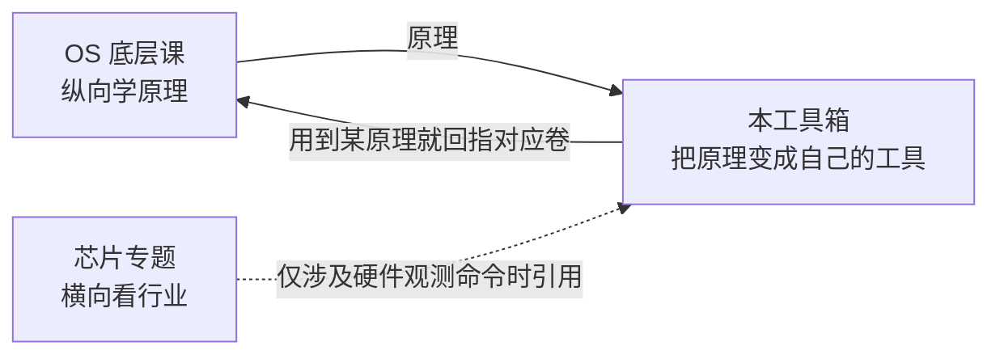
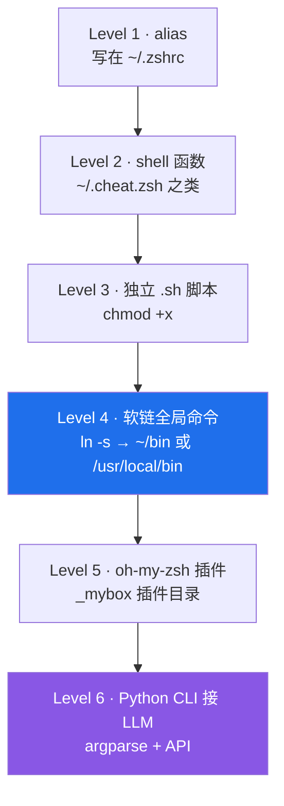
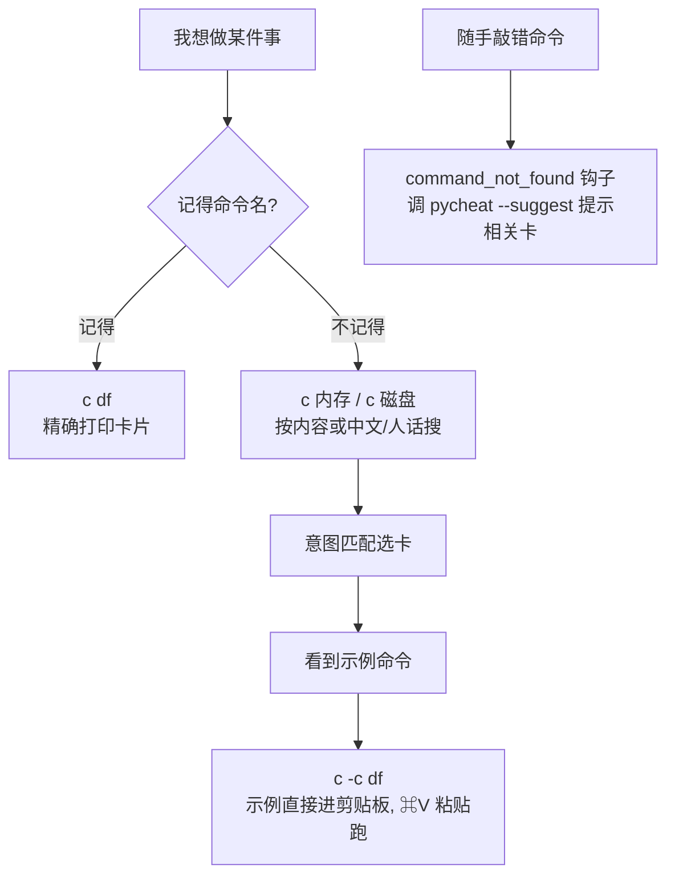

# 个人终端工具箱 (Personal Terminal Toolbox)

> **一句话定位**：把我亲手用 shell / Python 造的命令行工具与脚本，沉淀成可复用、可检索、可跨机器同步的个人命令库。
> **本文件是活文档**：每造一个新工具，就按固定字段加一张卡片；每学完 OS 课一卷，就把精选命令补进 `cheat` 数据源。
> 最后更新：2026-08-24（cheat 已废弃由 pycheat 取代；`c` 别名改指 pycheat；敲错提示钩子迁移为 `pycheat --suggest`）

---

## 0. 这个工具箱是什么 / 怎么用

### 0.1 与另外两门课的关系（分工不重复）



- **OS 课**（纵向学原理）→ 本工具箱负责「落地」：把卷里讲的机制变成你自己的命令。
- **芯片专题**（横向看行业）→ 只在用到硬件观测命令（`uname`/`sysctl` 等）时引用，**不展开原理**。
- **互相引用不重复**：本工具箱用到某个原理时，回指 OS 课对应卷（如软链回指第二卷、权限回指第五卷、GUI 不加载环境变量回指第四卷）。

### 0.2 每张工具卡的固定字段

> **用途 / 代码 / 关键技巧 / 踩坑 / 适用范围 / 关联 OS 课卷**

### 0.3 怎么新增一个工具

1. 在 `~/terminal-toolbox/` 下放源文件（alias/函数写在 `~/.zshrc` 或独立文件）。
2. 按上面字段在本文档「§4 工具卡片」追加一张卡。
3. 需要全局可用的，软链到 `~/bin`（参考 §附录A）。
4. 把 `~/terminal-toolbox/` 和本文档一起纳入同步（参考 §附录B）。

### 0.4 怎么跨机器同步

- 把 `~/terminal-toolbox/`（你的脚本源）+ `~/.config/cheat/cheatsheet.md`（命令卡）+ 本文档，用 git 私有仓库 / iCloud / Dropbox 同步。
- 新机器：拉下来 → 跑安装命令（软链 / `source`）→ 即可用。详见 §附录B。

---

## 1. 成长路线图（从 alias 到 AI CLI）



| 层级 | 形态 | 典型落点 | Windows 对照 |
|------|------|----------|--------------|
| L1 | 别名 | `~/.zshrc` 里 `alias ll='ls -la'` | `doskey ll=dir` 或 `$PROFILE` |
| L2 | 函数 | 独立文件 `~/.cheat.zsh` 被 source | PowerShell 函数写在 `$PROFILE` |
| L3 | 脚本 | `~/terminal-toolbox/xxx.sh` | `.ps1` 脚本 |
| L4 | 全局命令 | `ln -s` 到 `~/bin` 或 `/usr/local/bin` | 把脚本目录加进 `PATH` |
| L5 | 插件 | oh-my-zsh `plugins/_mybox/` | PowerShell 模块 `Import-Module` |
| L6 | Python CLI | `argparse` + LLM API，可 `pipx` 安装 | 同左 |

---

## 2. 我的环境基线（照抄不踩坑）

- **Shell**：zsh，配置文件 `~/.zshrc`（启动时加载；**GUI 应用不加载**，见工具 #1 踩坑）
- **Node**：nvm 管理，默认 v26.5.0（`~/.nvm/versions/node/v26.5.0/bin/`）
- **fzf**：已装（`/opt/homebrew/bin/fzf` v0.74.2）—— `pycheat` 交互选卡靠它（**需要真实终端**；非交互脚本环境里不弹窗）
- **脚本源目录**：`~/terminal-toolbox/`（已建，同步用）
- **用户级命令目录**：`~/bin`（已加入 `~/.zshrc` 的 `PATH`）
- **系统级命令目录**：`/usr/local/bin`（root 所属，软链需 `sudo`）

---

## 3. 工具索引（目录）

| # | 工具 | 层级 | 一句话 | 关联 OS 课卷 |
|---|------|------|--------|--------------|
| 1 | `cheat`（✗ 已废弃 2026-08-24） | L2 函数 | 旧版 zsh 速查，**已由 #4 `pycheat` 取代**（`c` 别名现指向 pycheat） | 第二卷·文件系统 / 第三卷·Shell / 第四卷·环境变量分裂 |
| 2 | `hi` | L3+L4 脚本 | 一行看「我是谁 / 哪台机器 / 什么系统」 | 0.0 硬件地基 / 第三卷·Shell |
| ✦ | `git` 命令卡（9 张） | L2 数据 | 状态/历史/提交/分支/同步/暂存/diff/远程/别名，见 §6.2 | 第六卷·实战 |
| 3 | `gup` | L3+L4 脚本 | 一键把当前仓库改动提交并推送（安全：先 pull、不删、不碰工作区外） | 第三卷·Shell / 第六卷·git |
| 4 | `pycheat` | L5 Python CLI | **说人话也能命中**的离线速查 + **开场屏**（置顶「你可能关心的指令」+ 最近查看 + ↻该复习的）+ **自学习别名**（越用越懂你）+ **本地 ollama 语义检索**（同义也能命中）+ 卡面分区配色：用途→用法→示例→通俗别名→踩坑→平台对照(macOS/Linux↔Windows) | 第三卷·Shell / 第六卷·git / 路线图阶段2 |

---

## 4. 工具卡片

### 工具 #1：`cheat` ✗ 已废弃（2026-08-24 由 `pycheat` 取代）

> ⚠️ **此工具已废弃**：旧版 `cheat` 是 zsh 函数（`~/.cheat.zsh`，依赖 fzf + 纯文本子串匹配），缺陷是 GUI 不加载 `.zshrc` 导致用不了、匹配不如「意图搜索」精准、需单独维护。现统一用 **`pycheat`（工具 #4）**——离线、零依赖、`c` 别名已改指向它，说人话就能搜。
>
> 废弃后 `~/.cheat.zsh` 仅保留两件轻量桥接：`alias c='pycheat'` 与 `command_not_found_handler`（敲错命令时调 `pycheat --suggest` 给提示）。旧函数代码见 `~/.cheat.zsh.bak.20260824`。

- **用途（历史）**：终端内即查即用的个人命令速查，核心设计是**不用背命令名**——记不住名字就按「想做的事」搜。该思路已完整迁移到 `pycheat`。
- **代码**（⚠️ 以下为**已废弃**的旧 zsh 实现，完整备份见 `~/.cheat.zsh.bak.20260824`；当前 `~/.cheat.zsh` 仅保留 `alias c='pycheat'` + 敲错提示钩子，请用 `pycheat`）：

```zsh
# 数据源：~/.config/cheat/cheatsheet.md
CHEAT_SHEET="$HOME/.config/cheat/cheatsheet.md"

# 打印某命令名的完整卡片
_cheat_block() {
  awk -v s="$1" 'BEGIN{f=0} /^## /{f=($0=="## "s)} f{print}' "$CHEAT_SHEET"
}

# 按关键词搜：命令名含关键词「或」卡片内容含关键词，都算命中
_cheat_kw_names() {
  local kw="$1"
  awk -v k="$kw" '
    /^## /{
      if(inblock && hit) print name
      inblock=1; name=substr($0,4); hit=0
      if (name ~ k) hit=1
      next
    }
    { if(inblock && $0 ~ k) hit=1 }
    END{ if(inblock && hit) print name }
  ' "$CHEAT_SHEET"
}

# 取某卡「示例」行里反引号包裹的命令（用于 -c 复制）
_cheat_examples() {
  awk -v s="$1" '
    BEGIN { f = 0 }
    /^## / { f = ($0 == "## " s) }
    f && /^- 示例:/ {
      line = $0
      while (match(line, /`[^`]+`/)) {
        print substr(line, RSTART+1, RLENGTH-2)
        line = substr(line, RSTART+RLENGTH)
      }
    }
  ' "$CHEAT_SHEET"
}

# 复制文本到剪贴板（macOS / Linux 自适应）
_cheat_copy() {
  if command -v pbcopy >/dev/null 2>&1; then
    print -n "$1" | pbcopy
  elif command -v xclip >/dev/null 2>&1; then
    print -n "$1" | xclip -selection clipboard
  elif command -v wl-copy >/dev/null 2>&1; then
    print -n "$1" | wl-copy
  else
    echo "（无剪贴板工具，仅打印）" >&2; echo "$1"; return
  fi
  echo "✅ 已复制到剪贴板，直接 ⌘V 粘贴运行：" >&2; echo "$1"
}

# 关键词搜索：列出匹配名 → fzf 选 → 打印卡片
_cheat_kw() {
  local kw="$1"
  local names; names=$(_cheat_kw_names "$kw")
  if [[ -z "$names" ]]; then
    echo "cheat: 没找到和 '$kw' 相关的命令卡。" >&2
    echo "       试试 cheat -l 看全部，或换个关键词。" >&2
    return 1
  fi
  if command -v fzf >/dev/null 2>&1; then
    local pick; pick=$(echo "$names" | fzf --prompt="匹配 '$kw' ▶ " --height=40% --reverse)
    [[ -n "$pick" ]] && _cheat_block "$pick"
  else
    echo "💡 和 '$kw' 相关的命令：" >&2; echo "$names" | column >&2
  fi
}

cheat() {
  if [[ ! -f "$CHEAT_SHEET" ]]; then
    echo "cheatsheet 不存在: $CHEAT_SHEET" >&2; return 1
  fi

  # -l 列出全部命令名
  if [[ "${1:-}" == "-l" || "${1:-}" == "--list" ]]; then
    grep -E '^## ' "$CHEAT_SHEET" | sed 's|^## ||' | column; return
  fi

  # -c 复制示例到剪贴板
  if [[ "${1:-}" == "-c" || "${1:-}" == "--copy" ]]; then
    local ex; ex=$(_cheat_examples "$2")
    if [[ -z "$ex" ]]; then
      echo "未找到 '$2' 的示例命令（可能该卡没有「示例:」行）。" >&2; return 1
    fi
    _cheat_copy "$ex"; return
  fi

  # 无参数：fzf 模糊选命令名
  if [[ $# -eq 0 ]]; then
    local names; names=$(grep -E '^## ' "$CHEAT_SHEET" | sed 's|^## ||')
    if command -v fzf >/dev/null 2>&1; then
      local pick; pick=$(echo "$names" | fzf --prompt="命令 ▶ " --height=40% --reverse)
      [[ -n "$pick" ]] && cheat "$pick"
    else
      echo "用法: cheat <命令/关键词>   当前可用命令：" >&2
      echo "$names" | column >&2
      echo "(装 fzf 后可直接 cheat 回车模糊选择: brew install fzf)" >&2
    fi
    return
  fi

  # 有参数：精确命中就打印；否则当关键词搜（记不全名字也能用）
  local q="$1"
  if grep -qxF "## $q" "$CHEAT_SHEET"; then
    _cheat_block "$q"
  else
    _cheat_kw "$q"
  fi
}

# 敲错命令时，主动提示 cheat 里相关的卡（zsh 特殊函数，仅交互 zsh 生效）
command_not_found_handler() {
  local tried="$1"
  [[ ${#tried} -lt 2 ]] && return 1
  local names; names=$(grep -E '^## ' "$CHEAT_SHEET" | sed 's|^## ||' | grep -iF "$tried")
  if [[ -z "$names" ]]; then
    names=$(_cheat_kw_names "$tried")
  fi
  if [[ -n "$names" ]]; then
    echo "💡 没找到命令 '$tried'，但 cheat 里有相关的：" >&2
    echo "$names" | tr '\n' ' ' >&2; echo "" >&2
    echo "   输入 cheat <名字> 看详情（直接 cheat 回车可模糊选）" >&2
  fi
  return 1
}

alias c='cheat'
```

- **关键技巧（历史，已迁移到 pycheat）**：
  - `cheat` 有参数时：先精确匹配命令名，匹配不到就**自动当关键词搜**（命令名含词 或 卡片内容含词，含中文）。所以 `cheat 内存`、`cheat 磁盘`、`cheat sys` 都能命中。**→ 这套思路在 pycheat 里升级为「意图搜索」（别名/拼音/中文二元组/模糊建议）。**
  - `-c` 把卡片里的「示例」命令复制到剪贴板（macOS 用 `pbcopy`），你 `⌘V` 直接粘贴运行，**不用手敲**。**→ pycheat 的 `c -c <说法>` 同样支持，且能按人话命中。**
  - `command_not_found_handler`：zsh 在命令找不到时自动调用，主动提示相关卡——**敲错命令也会被温柔提醒**。**→ 已迁移为调用 `pycheat --suggest`（非交互），功能保留。**
  - **交互浏览模式**（2026-08-22 新增）：`cheat` 或 `cheat <关键词>` 进入浏览，底部常驻菜单——`n/→` 下一张、`p/←` 上一张、`b` 回退、`f` 前进、`c` 复制示例、`/` 重新搜索、`q` 退出。**→ pycheat 的浏览菜单与之等价且支持开场屏（置顶+最近）。**
  - 非交互 shell（脚本/沙箱/`$(...)`）里自动退化为「只展示当前卡」，不会卡住。**→ pycheat 在非 tty 下自动关闭颜色并退化为清单，同理。**
  - 底层用 `awk` 按 `## 标题` 切分区块，`grep`/`sed` 抽名字，`column` 排版。**（旧实现，已删除）**
- **踩坑**：
  - **浏览菜单只在「真实交互终端」里表现完整**；在脚本/CI 等非交互壳里不会弹菜单、不自动触发（属正常），但不影响 `cheat -l`、精确查询、`-c` 复制等。
  - **GUI 应用（如 WeSight）里 `cheat` 用不了**——因为 GUI 不加载 `~/.zshrc`，函数没定义。这正是 **第四卷·环境变量分裂** 讲的根因；临时办法是 `sudo ln -sf` 把命令软链到 `/usr/local/bin`。
  - 数据源路径硬编码在 `~/.cheat.zsh` 里，**换机器要同步 `cheatsheet.md`**。
  - `cheat` 的「示例」复制依赖卡片里有 `- 示例: \`命令\`` 这行格式；没写的卡 `-c` 会提示无示例。
- **适用范围（历史）**：把 OS 课每卷精选命令存成卡片，终端里随查随用；已存 40 张。该数据源 `cheatsheet.md` 现在由 `pycheat` 读取（含 Windows↔macOS/Linux 对照）。
- **关联 OS 课卷**：第二卷·文件系统（cheatsheet.md 这个文件本身）、第三卷·Shell 与终端（zsh 函数 / alias / `command_not_found_handler`）、第四卷·环境变量分裂（GUI 不加载 .zshrc 的坑——这也是旧 `cheat` 被废弃、改投 `pycheat` 的动因之一）。

---

### 工具 #2：`hi`

- **用途**：一行看到「我是谁 / 在哪台机器 / 什么系统版本」；加 `-v` 额外打印芯片型号与内存（回指 0.0 硬件地基）。
- **代码**（`~/terminal-toolbox/hi.sh`）：

```bash
#!/usr/bin/env bash
# hi —— 一句话看到「我是谁 / 我在哪台机器 / 系统什么版本」
# 层级: 独立 .sh 脚本 + 软链全局命令（成长路线 第3/4级 演示）
# 关联 OS 课: 0.0 硬件地基（uname / sysctl 观测）、第三卷 Shell（变量 / 命令替换 / 测试）
set -euo pipefail

me="${USER:-$(whoami)}"
host="$(hostname -s 2>/dev/null || echo unknown)"
os="$(sw_vers -productName 2>/dev/null || uname -s) $(sw_vers -productVersion 2>/dev/null || echo '?')"
arch="$(uname -m)"
up="$(uptime | sed 's/^ *//')"

echo "👋  hi, $me @ $host"
echo "🖥   $os  ($arch)"
echo "⏱   $up"

if [[ "${1:-}" == "-v" || "${1:-}" == "--verbose" ]]; then
  chip="$(sysctl -n machdep.cpu.brand_string 2>/dev/null || echo '未知芯片')"
  mem_bytes="$(sysctl -n hw.memsize 2>/dev/null || echo 0)"
  mem_gb=$(( mem_bytes / 1024 / 1024 / 1024 ))
  echo "🔩  $chip  ·  ${mem_gb}GB 统一内存"
fi
```

- **关键技巧**：
  - `#!/usr/bin/env bash`：让系统去 `PATH` 里找 `bash`，比写死 `#!/bin/bash` 更可移植（第三卷：解释器与 shebang）。
  - `set -euo pipefail`：防御性编程——`e` 报错即停、`u` 用到未定义变量报错、`o` 管道中任一段失败也算失败。
  - `${USER:-$(whoami)}`：`${VAR:-默认值}`，`VAR` 为空时用默认值（第三卷：变量展开）。
  - 命令替换 `$(...)` 捕获命令输出；`||` 兜底让某命令不存在时也不崩（非 macOS 没有 `sw_vers`/`sysctl` 也能跑）。
  - `sysctl -n machdep.cpu.brand_string`：读内核参数看芯片型号（回指 0.0 硬件地基）。
- **踩坑**：
  - `sw_vers` / `sysctl` 是 **macOS 专属**；Linux 用 `/etc/os-release` + `lscpu`，Windows 用 `systeminfo`（本脚本用 `||` 兜底了）。
  - 软链到 `/usr/local/bin` 需 `sudo`（root 所属）；不想用 sudo 就用 `~/bin` + `PATH`（本机已配好用户级路径）。
  - 脚本必须 `chmod +x` 且首行 shebang 正确，否则 `hi` 会报 `command not found` 或 `permission denied`。
  - 软链目标要用**绝对路径**，否则 `hi` 会指向坏链接。
- **适用范围**：任何终端；它更是「独立脚本 + 软链」标准流程的**示范模板**——你造别的小工具时，照这个结构复制即可。
- **关联 OS 课卷**：0.0 硬件地基（uname / sysctl 观测）、第三卷·Shell 与终端（变量 / 命令替换 / 测试 / 退出码）。

**当前落地情况**（实测 2026-08-09）：
- 源文件 `~/terminal-toolbox/hi.sh` 已建、`chmod +x` 完成。
- 软链 `~/bin/hi → ~/terminal-toolbox/hi.sh`（用户级，无需 sudo，已在 `~/.zshrc` 把 `~/bin` 加入 `PATH`）。
- 实测 `hi` 与 `hi -v` 均正常输出。
- 尚未进系统级 `/usr/local/bin`（因 sudo 需交互密码）；如需系统级见 §附录A 的 4B 命令。

---

### 工具 #3：`gup`（一键 git 同步）

- **用途**：在「你要同步的 git 仓库」里，一行完成「看状态 → 先 pull → 暂存 → 提交 → 推送」。把 git 卡片讲的流程串成一次按键动作，省去手敲一长串。
- **代码**（`~/terminal-toolbox/gup.sh`，已软链 `~/bin/gup`）：

```bash
#!/usr/bin/env bash
# gup —— 一键把「当前 git 仓库」的改动提交并推送到远端
# 安全设计（呼应 §7 红线）：只在本仓库内操作；不删任何东西；先 pull 再提交；无改动则退出
set -euo pipefail

# —— 必须先 cd 到 git 仓库内 ——
if ! git rev-parse --is-inside-work-tree >/dev/null 2>&1; then
  echo "❌ 当前目录不是 git 仓库。请先「cd 到你要同步的仓库根目录」再跑 gup。" >&2
  exit 1
fi
root="$(git rev-parse --show-toplevel)"
cd "$root" || exit 1

branch="$(git symbolic-ref --short HEAD 2>/dev/null || echo main)"
echo "📁 仓库: $root  (分支: $branch)"

# —— 无改动则直接退出（不做任何写操作）——
if [ -z "$(git status --porcelain)" ]; then
  echo "✅ 没有改动，无需提交。"
  if git remote | grep -q .; then git fetch --quiet 2>/dev/null || true; fi
  exit 0
fi

echo "📦 将提交以下改动（M 改 / A 加 / D 删 / ?? 未跟踪）："
git status --short

# —— 先拉远端（仅快进，避免覆盖你的本地历史）——
if git remote | grep -q .; then
  echo "⬇️  先 git pull（--ff-only）..."
  if ! git pull --ff-only; then
    echo "⚠️  pull 失败或产生冲突。请手动「git pull」解决后再跑 gup。" >&2
    exit 1
  fi
fi

# —— 暂存并提交（只针对本仓库内改动；敏感目录请用 .gitignore 排除）——
git add -A
msg="auto: 同步于 $(date '+%Y-%m-%d %H:%M')"
git commit -m "$msg" >/dev/null
echo "✅ 已提交: $msg"

# —— 推送（没有 upstream 就给命令，而不是直接报错）——
if git remote | grep -q .; then
  if git rev-parse --abbrev-ref --symbolic-full-name '@{u}' >/dev/null 2>&1; then
    git push && echo "⬆️  已推送。" || { echo "⚠️  push 失败（可能被拒绝）。先手动「git pull」合并后再 gup。" >&2; exit 1; }
  else
    echo "ℹ️  当前分支 '$branch' 没有 upstream，未自动推送。"
    echo "    首次推送请手动：git push -u origin $branch"
  fi
else
  echo "ℹ️  没有配置 remote，仅完成本地提交（要同步到远端先：git remote add origin <url>）。"
fi

echo "✅ 完成。"
```

- **关键技巧**：
  - `git rev-parse --is-inside-work-tree`：先确认「当前目录是 git 仓库」，避免误把非仓库目录当成目标。
  - `git rev-parse --show-toplevel` + `cd "$root"`：锁定到仓库根，**只在这个目录内操作**，绝不递归到外面、绝不用 `rm`。
  - `git symbolic-ref --short HEAD`：即使空仓库（还没任何提交）也能拿到分支名，避免 `HEAD` 报错。
  - `--ff-only` 拉取：只接受快进合并，绝不改写本地已有历史；冲突就停下来让人处理。
  - `git rev-parse --abbrev-ref --symbolic-full-name '@{u}'`：判断当前分支有没有 upstream，没有就给出 `git push -u` 命令而非直接报错。
  - 全程没有 `rm`/`reset --hard`/强制推送，符合 §7 红线；也不碰 `~/.workbuddy/workbuddy.db`（自动化数据）。
- **踩坑**：
  - **只在该同步的 git 仓库里用**：仓库里不该出现敏感文件（密钥、`.workbuddy` 项目数据），请用 `.gitignore` 排除——脚本的 `git add -A` 会把仓库内所有改动一起提交。
  - 首次推分支需先 `git push -u origin <分支>` 建立跟踪，脚本检测到没有 upstream 会提示你手动建，不会硬推失败。
  - 若 pull 产生冲突，`gup` 会停下让你手动解决，**不会强行覆盖**。
  - 软链到 `/usr/local/bin` 需 sudo（和 `hi` 同样），本机已用 `~/bin` 用户级方案。
- **适用范围**：任何你维护的 git 仓库（如知识中枢、个人工具箱本身）。它是「独立脚本 + 软链」流程的第二个示范模板。
- **关联 OS 课卷**：第三卷·Shell 与终端（变量 / 命令替换 / 退出码 / `set -euo pipefail`）、第六卷·git 实战、§7 安全红线。

**当前落地情况**（实测 2026-08-22）：
- 源文件 `~/terminal-toolbox/gup.sh` 已建、`chmod +x` 完成。
- 软链 `~/bin/gup → ~/terminal-toolbox/gup.sh`（用户级，无需 sudo，已在 PATH）。
- 已在一次性临时仓库里实测：空仓库首次提交 / 无改动直接退出 / 有新改动再提交 / 非 git 目录安全报错退出，临时仓库已清理。
- git 别名：`alias g='git'`、`gs`/`gl`/`gp`/`gpl`/`gd` 等可在 `~/.zshrc` 加，或直接启用 oh-my-zsh 的 git 插件（见 cheatsheet 的「git 别名」卡）。

---

### 工具 #4：`pycheat`（说人话也能命中的离线速查 · 路线图阶段2）

- **用途**：`cheat` 的「阶段2」升级版——把搜索从「字面子串」升级成「按意图」，解决「中文模糊查询不是什么都能命中」的痛点。你不用记命令名，只管说想做的事（中文 / 拼音 / 英文都行），它返回最像的那张卡；搜不到也给「你是不是想找 X」。
- **为什么不用 LLM**：你要求「不能太复杂」+ 默认离线，所以**这版纯标准库、零依赖、永远可用**，不引任何模型/密钥。LLM 只作为**预留开关**（见下）。
- **代码**（`~/terminal-toolbox/pycheat.py`，已软链 `~/bin/pycheat`）：

```python
#!/usr/bin/env python3
# pycheat — 离线零依赖命令速查 CLI
# 用法:
#   pycheat                开场屏（置顶+最近+↻该复习的）→ 输入人话搜 / 数字选卡 / 回车看全部
#   pycheat <说法>         按意图搜（命令名/别名/拼音/内容/中文二元组）→ 进入浏览可继续翻
#   pycheat -c <说法>      把最佳匹配的「示例」复制到剪贴板
#   pycheat -l             列出全部命令（带编号 + 一句话用途）
#   pycheat --learn [show|clear]   查看 / 清空「自学习别名库」
#   pycheat --forget <说法>         忘掉某个自学习说法
#   pycheat --llm <说法>   本地 ollama 语义检索（同义/近义也能命中；无 ollama 时自动退回本地）
# 交互浏览底部菜单: n/→/j 下一张 · p/←/k 上一张 · b 回退 · f 前进 · c 复制 · / 搜索 · q 退出
import argparse, difflib, os, re, shutil, subprocess, sys
CHEAT_SHEET = os.path.expanduser("~/.config/cheat/cheatsheet.md")

def load_cards(path):
    cards, cur = [], None
    for line in open(path, encoding="utf-8"):
        line = line.rstrip("\n")
        m = re.match(r"^##\s+(.*)$", line)
        if m:
            cur and cards.append(cur)
            cur = {"name": m.group(1).strip()}; continue
        fm = re.match(r"^-\s*([^:：]+)[:：]\s*(.*)$", line)
        if fm and cur is not None:
            cur[fm.group(1).strip()] = fm.group(2).strip()
    cur and cards.append(cur)
    return cards

def bigrams(s):
    s = s.lower()
    return {s[i:i+2] for i in range(len(s)-1)} if len(s) > 1 else {s}

def overlap(a, b):
    x, y = bigrams(a), bigrams(b)
    return min(len(x & y), 3) if x and y else 0

def aliases_of(c):
    return [a.strip().lower() for a in c.get("别名", "").split(",") if a.strip()]

def score_card(c, q):
    q = q.lower().strip();  s = 0;  name = c["name"].lower()
    if q == name: s += 100
    elif q in name or name in q: s += 55
    s += 25 * overlap(q, name)
    for a in aliases_of(c):
        if q == a: s += 90
        elif q in a or a in q: s += 45
        s += 30 * overlap(q, a)
    blob = " ".join(c.get(f, "") for f in ("作用","用法","示例","踩坑")).lower()
    if q in blob: s += 18
    s += 10 * overlap(q, blob)
    return s

def suggest(cards, q):
    cands = [c["name"].lower() for c in cards] + [a for c in cards for a in aliases_of(c)]
    out = []
    for cc in difflib.get_close_matches(q.lower(), cands, n=3, cutoff=0.35):
        for c in cards:
            if cc == c["name"].lower() or cc in aliases_of(c):
                if c["name"] not in out: out.append(c["name"])
                break
    return out[:3]

def render(c):
    bar = "─" * 46
    print("┌─ " + c["name"] + " " + bar)
    print("│ 用途: " + c.get("作用",""))
    print("│ 示例: " + c.get("示例",""))
    print("│ ── 细节 ──")
    for f in ("用法","踩坑","Windows对照","来源卷"):
        if f in c: print("│ " + f + ": " + c[f])
    print("└" + bar)

def main():
    ap = argparse.ArgumentParser()
    ap.add_argument("query", nargs="*"); ap.add_argument("-c","--copy",action="store_true")
    ap.add_argument("-l","--list",action="store_true"); ap.add_argument("--llm",action="store_true")
    args = ap.parse_args()
    cards = load_cards(CHEAT_SHEET)
    if args.list:
        list_all(cards); return          # 格式化编号清单（带用途），不再裸拼名字
    if not args.query:
        # 无参数：真实终端先进开场屏（置顶+最近 REPL）；非 tty 给格式化清单
        if sys.stdin.isatty():
            show_opening(cards)          # 开场屏：输入人话搜 / 数字选卡 / 回车看全部 / ? 帮助
        else:
            list_all(cards)
        return
    q = " ".join(args.query).strip()
    if args.llm:
        ranked = fused_rank(cards, q, require_llm=True)   # 强制语义：ollama 不可用直接报错退出
    else:
        ranked = search_rank(cards, q)                    # 自动探测 ollama：本地为主 + 语义温和加成（融合）
    # fused_rank：score_card() 本地分占主导，语义相似度只做相对温和加成，绝不覆盖清晰本地命中
    if not ranked:
        print("pycheat: 没找到和「%s」相关的命令卡。" % q)
        sug = suggest(cards, q)
        print("        你是不是想找：" + " / ".join(sug)) if sug else print("        试试 pycheat -l 看全部，或换个说法。")
        return
    best = ranked[0][1]
    if args.copy:
        try: subprocess.run(["pbcopy"], input=best.get("示例",""), text=True, check=True)
        except Exception: pass
        print("✅ 示例已复制: " + best.get("示例","")); return
    render(best)
    if len(ranked) > 1: print("其他相关: " + " / ".join(c["name"] for _,c in ranked[1:4]))

if __name__ == "__main__":
    main()
# 注：交互浏览所需的 list_all() / pick_card() / browse() / read_key() 四个函数也在
#     ~/terminal-toolbox/pycheat.py 中（单键 termios 读取 + fzf 选卡 + 清屏翻页），
#     此处仅截取核心匹配逻辑；完整代码以该文件为准。
```

- **关键技巧**：
  - **`别名:` 字段是灵魂**：每张卡可加一行 `- 别名: 看内存, neicun, memory`，把人话/拼音/英文映射到命令。已用 `seed_aliases.py` 给 22 张核心卡预填了别名。
  - **中文二元组重叠**（`overlap`）：不引任何库，靠「连续 2 字片段」重叠捕捉长人话，例如「看哪个程序最占内存」靠共享「最占内存」命中 `top / htop`。这是比纯子串匹配聪明的关键。
  - **`difflib.get_close_matches`**：无命中时给 top-3 建议，不再一片空白。
  - **卡面分区块配色（2026-08-24 改版）**：不再灰白一行流，而是**分区留白、字段配色、按固定顺序排版**，治「看不清、挤成一团」。顺序与配色：
    - `用途` —— **青色**（cyan），先说这命令干嘛
    - `用法` —— **绿色**，该敲的命令语法
    - `示例` —— **黄色**，`code` 包住的部分自动加粗，一眼看到该敲啥
    - `通俗别名` —— **品红**（magenta），把人话/拼音别名列出来方便记忆
    - `踩坑` —— **红色**，醒目区分易错点
    - `平台对照` —— **蓝色**，清晰分两行：`macOS / Linux : <命令>` 与 `Windows : <对照>`，不再和别的字段混在一起
    - `来源` —— 灰色（dim），收尾
    - 颜色仅在**真实交互终端**生效；管道/重定向或设了 `NO_COLOR` 时自动关闭，不影响脚本使用。
  - **交互浏览模式（2026-08-24 修掉「裸列表即退」）**：`pycheat` 无参不再把 40 个名字空格拼一坨就退出，而是进浏览——真实终端里用 **fzf 选卡（带用途、可搜）**，选完进入底部菜单循环：`n/→/j` 下一张、`p/←/k` 上一张、`b` 回退、`f` 前进（历史栈）、`c` 复制示例、`/` 重新搜索、`q` 退出，**全程不退出**。带查询时（如 `pycheat 内存`）也直接进浏览，从最佳卡开始按相关度翻看其它匹配。非交互终端（脚本/管道）自动退化为「渲染首张即退出」，不卡死。
  - **本地 ollama 语义检索（2026-08-27 落地；2026-08-22 改为「融合排序」）**：`pycheat` 现在用本机 `ollama` 的嵌入模型（默认 `nomic-embed-text`，若本机已拉取中文更强的 `bge-m3` 会自动优先）做向量语义匹配，并采用**本地匹配为主、语义为温和加成**的融合排序（fusion）——余弦相似度只做相对温和加成（归一到 [0,1] 乘 `SEMANTIC_W=15`），**绝不覆盖一个清晰的本地命中**；零本地分的近义卡也能被语义抬出。**同义/近义也能命中**（如「哪个进程吃 RAM」↔ `top / htop`），比二元组更懂语义。实现零额外依赖（仅 `urllib` 调本机 `http://localhost:11434/api/embeddings`）；卡片向量按内容 hash 缓存在 `~/.config/cheat/.pycheat_vectors.json`，首次拉取后增量更新。行为：无参数/带查询时**自动探测 ollama**，在跑就融合排序、否则退回离线；`--llm` 显式强制（不可用则报错）、`--no-llm` 强制离线。开场屏会提示「🧠 语义检索已启用（ollama · <模型名>）」。
  - **开场屏（2026-08-24 新增，`pycheat` 无参默认进入）**：不再是「列表即退」，而是先递上门面——顶部「说人话就能搜」演示人话搜索能力；中部「★ 你可能关心的指令」是**置顶(`常用: 是`)+ 最近浏览**的混合并列（你选的方案），编号 + 一句话用途 + 真实命令，按数字直接跳进该卡；底部「↺ 最近查看」让开场有活气。它是一个小型 REPL：直接打字=人话搜、`数字`=跳卡、`回车`=看全部(fzf)、`?`=帮助。`常用: 是` 标记在 cheatsheet 里手动维护（已标 vm_stat/df/top·htop/find/brew/git status 六张），最近浏览来自本地文件 `~/.config/cheat/.pycheat_recent`（零依赖、自动记录、上限 60 行）。
  - **增量自学习别名（2026-08-27 新增）**：你每次用人话搜并命中某卡，pycheat 会把这个「说法 → 命令」悄悄记到本地 `~/.config/cheat/.pycheat_learned.json`。下次再打同样或同义说法，**直接命中**——越用越懂你的说话习惯。只在「说法不是现成命令名/别名」时才学，避免污染；命令名/别名本身不进库。`pycheat --learn show` 看已学说法与命中次数、`--learn clear` 清空、`--forget <说法>` 单项遗忘。
  - **间隔复习推送（2026-08-27 新增）**：开场屏在「最近查看」下方新增「↻ 该复习的」。它按本地记忆强度文件（每张卡查看次数 + 上次时间）挑「看过但快忘的」——看 < 3 次、或 > 7 天没看的卡会被提醒；从没看过的只算新学不进复习。把速查工具顺便变记忆复习器，贴合边学边记。
- **踩坑**：
  - 拼音别名要**手填**进卡片（没引 pypinyin 库，保持零依赖）；想加拼音就往 `别名:` 里写。
  - 别名越多越准，但属于「一次性维护活」；`seed_aliases.py` 可重复跑（已存在的跳过）。
  - 旧 `cheat`（zsh + fzf）**已于 2026-08-24 废弃**，统一由 `pycheat` 取代；`c` 别名现指向 `pycheat`，敲错提示钩子改调 `pycheat --suggest`。
- **适用范围**：终端里「说人话找命令」的终极形态，离线、即查即用；已实测 `看哪个程序最占内存→top/htop`、`装个新软件→brew`、`哪个文件夹最大→du`、`neicun→vm_stat`、无命中给建议。
- **关联 OS 课卷**：第三卷·Shell（Python 脚本 / 命令行）/ 第六卷·git；对应成长路线「阶段2 转 Python CLI 接 LLM」。

---

## 5. 下一步可造的工具（草稿，等你挑）

| 候选 | 层级 | 想解决的问题 | 关联卷 | 状态 |
|------|------|--------------|--------|------|
| ✅ `gup`（一键 git 同步） | L3+L4 | 当前仓库改动一键提交并推送（安全：先 pull、不删、不碰工作区外） | 第三卷 / 第六卷 | **已实现（工具 #3）** |
| ✅ `git 别名` 卡 | L2 数据 | `g`/`gs`/`gl`/`gp`/`gpl` 等短别名 | 第三卷 / 第六卷 | **已进 cheatsheet** |
| ✅ `pycheat`（说人话命中·离线） | L5 Python CLI | 按意图搜（别名/拼音/中文二元组/模糊建议），卡面用途+示例优先 | 第三卷 / 第六卷 / 路线图阶段2 | **已实现（工具 #4）** |
| `sys` | L2/L3 | 一行系统快照（CPU/内存/磁盘/负载） | 0.0 / 第一卷 | 待造 |
| `port` | L3 | 查端口被谁占用（lsof -i） | 第二卷 | 待造 |
| `killp` | L3 | 按进程名批量杀（pkill） | 第一卷 | 待造 |
| `bak` | L3 | 自动加日期备份文件（`cp x -> x.2026-08-09.bak`） | 第二卷 | 待造 |
| `myip` | L3 | 看内网/公网 IP | 网络（下一站） | 待造 |

---

## 6. 高效使用姿势（即查即用，不用背命令）

### 6.1 核心心法

> **你不需要记住任何命令。** 你只需要两种能力：① 用 `pycheat`（或短名 `c`）按「想做的事」找到它；② 用 `c -c <说法>` 把示例命令复制下来直接跑。



### 6.2 命令速查表

| 你想干嘛 | 敲什么 | 说明 |
|----------|--------|------|
| 浏览/漫游全部命令 | `c` 回车 | 开场屏（置顶+最近）→ fzf 模糊选 |
| 记得名字，看详情 | `c df` | 精确打印卡片 |
| **不记得名字，只记得想干嘛** | `c 内存` / `c 磁盘` / `c 进程` | 按意图/卡片内容/中文搜 |
| 只记得名字开头几个字母 | `c sys` / `c unam` | 按命令名子串搜 |
| **把示例命令复制下来直接跑** | `c -c df` | 进剪贴板，`⌘V` 即可运行 |
| 列出全部命令名 | `c -l` | 复习/漫游用 |
| 敲错命令被提醒 | （随便敲个错字） | zsh 自动提示 pycheat 里相关的 |
| **git 想干嘛就搜啥** | `c 提交` / `c 分支` / `c 同步` / `c 暂存` | 按中文意图命中 git 卡 |
| git 精确卡 | `c git status` / `c git log` | 打印完整卡片 |
| **开场屏（无参默认）** | `pycheat` → 置顶「你可能关心的指令」+ 最近查看 → 输入人话搜 / 数字跳卡 / 回车看全部 | 顶部演示「说人话就能搜」；`?` 看帮助 |
| 说人话直接命中（推荐） | `pycheat 看哪个程序最占内存` / `pycheat 装个新软件` / `pycheat 哪个文件夹最大` | 离线按意图搜，别名/拼音/中文二元组都行 |
| 命中后继续翻看 | `pycheat 内存` | 从最佳卡 `vm_stat` 起，按相关度翻看其它匹配（共 N 张） |
| 拼音也能搜 | `pycheat neicun` | 拼音别名命中 `vm_stat` |
| 搜不到给建议 | `pycheat zzzqqq` | 无命中时列「你是不是想找 X / Y / Z」 |
| 复制示例直接跑 | `pycheat -c df` | 进剪贴板，`⌘V` 运行 |
| 纯看清单 | `pycheat -l` | 编号 + 一句话用途，格式化不裸拼 |
| **越用越懂你：自学习别名** | `pycheat 看哪个程序最占内存`（命中后） | 该说法被记进本地库，下次打同样/同义说法直接命中 |
| 查看/清空自学习库 | `pycheat --learn show` / `--learn clear` | 看已学说法与命中次数；清空重来 |
| **本地 ollama 语义检索（同义也能命中）** | `pycheat 哪个进程吃 RAM`（ollama 在跑时自动启用） | 本地为主+语义温和加成的融合排序，比二元组更懂同义说法；`--llm` 强制 / `--no-llm` 强制离线；默认 nomic-embed-text，有 bge-m3 自动优先 |
| 忘掉某个说法 | `pycheat --forget 看哪个程序最占内存` | 单项遗忘，不影响其它 |
| 开场屏「↻ 该复习的」 | `pycheat`（无参） | 自动挑「看过但快忘的」卡提醒复习 |

### 6.3 让记忆「长」在你身上的小技巧

- **每次学到新命令，顺手补一张卡**：往 `~/.config/cheat/cheatsheet.md` 末尾加 `## 命令名` 区块（`pycheat` / `c` 自动识别，不用重启）。卡片字段固定为：作用 / 用法 / 示例 / 踩坑 / Windows对照 / 来源卷。
- **给命令起「人话别名」**：如果某个命令你老忘，在 cheatsheet 加 `别名:` 字段（中文/拼音/英文都行），`pycheat` 按意图命中。
- **用 `-c` 代替手敲**：凡是示例命令长的，直接 `c -c <说法>` 复制，避免敲错。
- **利用敲错提示**：经常敲错的词，正是你该补卡或加 alias 的信号。

---

## 7. git 安全同步须知（重要）

你打算用 git 同步工具箱（脚本 + 命令卡 + 本文档）。这里几条红线必须遵守，避免把"同步"变成"删库":

> ⚠️ **此操作非常危险，可能导致不可逆的数据丢失！** 下面的禁用项绝对不能绕过。

- **自动化数据绝不手动删**：本机的自动化（定时任务）存在 SQLite 数据库 `~/.workbuddy/workbuddy.db`，**永远不要用 `rm`、`sqlite3` 或 shell 命令删除**——只能用专门的自动化管理工具。要新建/改/删自动化，告诉 WorkBuddy 用对应工具处理。
- **个人目录只扫不改**：用 git 同步时，只对工具箱相关文件（`~/terminal-toolbox/`、`~/.config/cheat/cheatsheet.md`、本文档）做版本管理；**不要** `git add ~/Desktop` / `~/Documents` 全盘、不要递归删。只提交你明确要同步的文件。
- **先备份再动**：任何 move/rename/delete 之前，`cp -r` 一份备份并确认成功，再操作；优先用系统回收站而非 `rm`。
- **git 本身的安全习惯**：
  - 提交前一定 `git status` 看清楚范围，别 `git add -A` 一把梭把敏感文件（密钥、`.workbuddy` 项目数据）塞进去。
  - 远程推送前先 `git pull` 再 `git push`，避免覆盖别人的/自己的提交。
  - 删除文件用 `git rm` 走版本历史，不要直接 `rm` 后以为"删干净了"——git 里仍有历史。
  - 跨机器同步冲突时，先 `git diff` 看清差异再决定，别盲目 `--force` 强推。

---

## 8. 还能怎么迭代（路线图，随时挑着做）

工具箱已用 `pycheat` 统一入口（旧 `cheat` 于 2026-08-24 废弃）。下面按「信号价值」排序的几个下一步，挑你顺手的做：

| 优先级 | 方向 | 能解决什么 | 怎么落地（轻量） |
|--------|------|-----------|------------------|
| ★★★ | **收藏 / 高频置顶** | 你常查的命令总在翻，应该一打开就在前面 | **已落地**：cheatsheet 加 `常用: 是` 标记，`pycheat` 开场屏「★ 你可能关心的指令」自动置顶 |
| ★★★ | **左分类 / 侧边树** | 40+ 卡之后纯线性翻太累，按「卷 / 类别」分组跳转 | 卡片加 `分类:` 字段，`pycheat` 启动先选分类再浏览 |
| ★★☆ | **跨会话记忆** | 下次打开直接回到上次看的位置、知道最常看哪张 | 把「上次位置 / 访问计数」写进 `~/.config/cheat/cheat.state`（追加式，只读不改源码） |
| ★★☆ | **关联跳转** | 卡片里提到别的命令（如 `du` 引 `df`），能一键跳过去 | 卡片正文写 `→df`，菜单加 `Enter` 跳转到该卡 |
| ★★☆ | **从你的 history 学习** | 监测你常敲的命令，主动建议「要不要加张卡」 | 写个 `cheat --learn` 扫描 `~/.zsh_history` 出现频率 |
| ★★★ | **本地 ollama 语义检索**（阶段2·已落地） | `pycheat "哪个进程吃 RAM"` 同义/近义也能命中 | **已用 `pycheat` + 本机 ollama 向量检索（融合排序：本地为主+语义温和加成）**：默认 nomic-embed-text，有 bge-m3 自动优先；自动探测，无 ollama 退回离线；`--llm` 强制 / `--no-llm` 强制离线；零额外依赖（urllib 调 11434） |
| ★☆☆ | **卡片内锚点 / 折叠长卡** | 部分卡内容长，想直接跳到「示例」或「踩坑」 | 菜单加 `e` 只看示例、`w` 只看踩坑 |

> 我个人建议先上 **收藏置顶 + 分类树**——这是 40 张卡之后体验跃升最大的一步，且纯数据层改动、不碰交互逻辑。

---

## 附录 A：安装命令速查

```bash
# —— hi 的安装（已帮你做好用户级）——
mkdir -p ~/terminal-toolbox                 # 1) 源目录（同步用）
# 2) 把脚本存为 ~/terminal-toolbox/hi.sh
chmod +x ~/terminal-toolbox/hi.sh           # 3) 加可执行权限

# 4A) 用户级（无需 sudo，推荐同步场景，本机已配）：
ln -sf ~/terminal-toolbox/hi.sh ~/bin/hi
#     确保 ~/.zshrc 有：export PATH="$HOME/bin:$PATH"

# 4B) 系统级（需 sudo，所有用户可用）：
sudo ln -sf ~/terminal-toolbox/hi.sh /usr/local/bin/hi

# 5) 新开终端 或 source ~/.zshrc，然后：
hi          # 普通模式
hi -v       # 看芯片型号
```

```bash
# —— 桥接层说明（备查）——
# ~/.cheat.zsh 已废弃旧 cheat 函数，现仅保留 alias c='pycheat' + command_not_found_handler(调 pycheat --suggest)
# ~/.zshrc 第 8 行：[ -s "$HOME/.cheat.zsh" ] && \. "$HOME/.cheat.zsh"
# 数据源：~/.config/cheat/cheatsheet.md（pycheat 读取；仓库自带 cheatsheet.md 兜底）
# 每学完一卷，往 cheatsheet.md 末尾加一个 `## 命令名` 区块即可，pycheat/c 自动识别
```

## 附录 B：跨机器同步方案

1. 把下面三样纳入同一 git 私有仓库 / iCloud / Dropbox：
   - `~/terminal-toolbox/`（你的脚本源）
   - `~/.config/cheat/cheatsheet.md`（命令卡）
   - 本文档 `个人终端工具箱.md`
2. 新机器拉取后：
   - `chmod +x ~/terminal-toolbox/*.sh`
   - 跑上面的软链命令（`ln -s`）
   - 把 `source ~/.cheat.zsh`（桥接层：定义 c 别名与敲错提示）、`export PATH="$HOME/bin:$PATH"` 加进新机器的 `~/.zshrc`
3. 这样「造一次，处处可用」。

## 附录 C：维护约定

- **工具卡**：每造一个工具 +1 张卡；字段严格按 §0.2。
- **命令卡**（`pycheat` 数据源）：每学完 OS 课一卷，往 `cheatsheet.md` 补该卷精选命令。
- **升级路径**：阶段1 zsh 函数 + fzf（**已废弃**）→ 阶段2 Python CLI `pycheat`（已落地·离线·意图搜索）→ 阶段3 做 AI Skill（slash command）——**数据源 cheatsheet.md 不动**。
