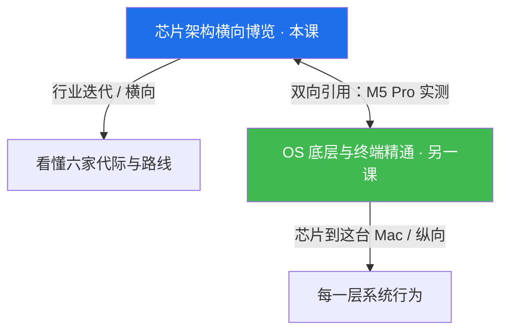
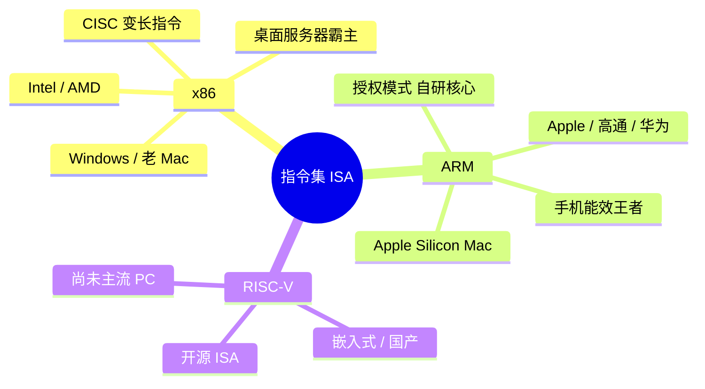
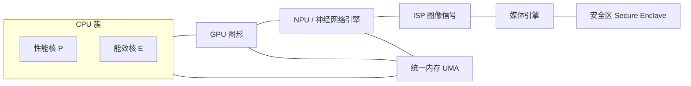
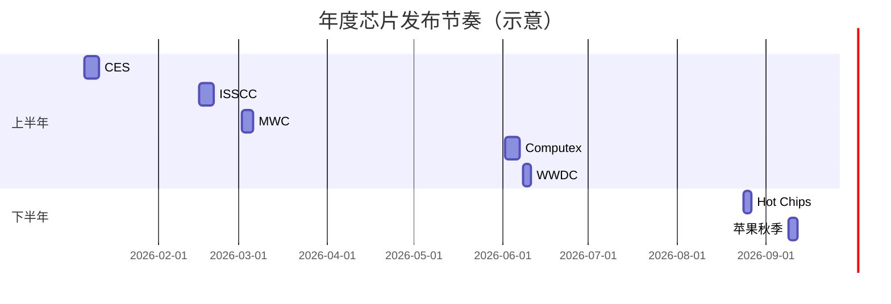

# 芯片架构横向博览 · 知识系统

> **定位**：横向知识地图。建立「行业格局 + 代际演进认知 + 自己跟进更新的能力」。
> **与 OS 课分工**：OS 课《操作系统底层与终端精通》是**纵向学以致用**（芯片 → 这台 Mac 的每层行为）；本课是**横向博览**（整个行业怎么迭代）。两课互相引用、不重复。
> **风格**：对照讲解（Windows ↔ macOS/Unix）、图示优先、能动手的就动手、不空泛。



> 本课涉及 Apple Silicon 时，只**引用**你在 OS 课 0.0 节的实测（Apple M5 Pro / arm64 / 24GB 统一内存），不在此展开 macOS 系统层细节——那归 OS 课。

---

## 怎么用这份「活文档」（维护约定）

本文档的核心是一条**代际时间线总表**（见第 ② 篇末），它会一直长大：

- **新增芯片时**：在你转发的新闻/规格下，按下面格式往「代际时间线总表」追加一行，并保留来源链接。
- **追加格式**（手动，由我帮你并入）：

  ```markdown
  | 厂商 | 产品 | 发布时间 | 工艺 | 架构亮点 | 来源 |
  |------|------|----------|------|----------|------|
  | Apple | M6 | 2027-xx | TSMC N2 | … | [链接] |
  ```

- **实测样本**：你手上的 **Apple M5 Pro**（arm64 / 15 核 / 24GB 统一内存）是贯穿全课的活样本，数据来自本机 `sysctl` / `system_profiler` 实测（见第 ④ 篇）。

---

# ① 地基概念 —— 先会「读」芯片

读不懂一颗芯片，就只看懂了营销页。这一篇给你「读芯片」的通用语汇，之后看任何厂商都套得上。

## 1.1 ISA 指令集架构（最底层的一层）

**一句话**：ISA 是芯片「听得懂的语言」。它决定了**什么软件能在这颗芯片上原生跑**。

- **x86（CISC，复杂指令集）**：Intel 与 AMD 的领地。特点是指令**变长**、单条能做很多事，历史包袱重但生态无敌——几乎全部桌面/服务器软件都是 x86 原生。
  - *Windows 对照*：你以前用的 Windows 电脑基本都是 x86；换到 Mac 后这台是 **arm64**（见 1.3）。
- **ARM（RISC，精简指令集）**：ARM 公司只**卖授权、不造芯片**。客户自己设计核心。Apple（M 系列）、Qualcomm（Snapdragon）、华为（麒麟）都基于 ARM 指令集。RISC 指令定长、简单、省电——手机能效的基石。
  - 关键认知：**ARM 是「授权」不是「芯片」**。Apple 用的是 ARM 指令集，但核心是自家设计的（不是公版 Cortex）。
- **RISC-V（开源 RISC）**：完全开放、可自由定制。目前在嵌入式、国产芯片里崛起（受制裁背景下国内重点关注），但尚未成为 PC/手机主流。

**为什么 ISA 决定兼容性（呼应 OS 课）**：Apple 在 2020 年把 Mac 从 x86 换到 ARM（Apple Silicon）。旧 x86 软件在新 Mac 上靠 **Rosetta 2** 在运行时翻译成 ARM 指令。这正是 OS 课会说到的「指令集切换 → 翻译层 → 性能代价」的来龙去脉。Windows on ARM 同理需要 x86-64 模拟（Win11 已支持）。



> **动手**：看自己机器是哪一「族」——macOS 跑 `uname -m` → 你的结果是 `arm64`（ARM 家族）；老 Windows 机通常是 `x86_64`。

## 1.2 制程（纳米数到底意味着什么）

**一句话**：nm 数字早已不是物理栅长，而是**营销代号 + 密度代际**。越小 ≠ 一定越快，但同功耗下通常更强。

- **FinFET → GAA（环栅）的转折**：约 22nm 到 3nm 用的是 **FinFET**（鳍式场效应管，导电沟道立起来像鱼鳍）。到 3nm/2nm 转向 **GAA（Gate-All-Around，纳米片/纳米带）**，栅极从四面裹住沟道，漏电更少、密度更高。
  - Samsung 3nm（2022）率先 GAA；TSMC **N2（2nm，约 2025/26）** 才上 GAA；Intel **20A/18A** 用自研 **RibbonFET**（即 GAA）+ **PowerVia**（背面供电）。
- **台积电 vs Intel 命名对照（最容易看晕）**：

  | 代号 | 实际代际 | 用在哪 |
  |------|----------|--------|
  | TSMC N7 | ~7nm | Zen 2/3、早期 Apple |
  | TSMC N5/N5P | ~5nm | M1/M2、Zen 4 |
  | TSMC N3（N3B/N3E） | ~3nm | M3/M4、A17 Pro |
  | TSMC N2 | ~2nm（GAA） | 2025/26 新品 |
  | Intel 7 | **10nm 级**（Enhanced SuperFin） | 12/13/14 代酷睿 |
  | Intel 4 | ~7nm 级 | Meteor Lake |
  | Intel 20A / 18A | ~2nm 级（GAA） | Panther Lake（2025/26） |

  > ⚠️ 看到「Intel 7」别当成 7nm——它本质是 10nm 改良。各家的「nm」口径不同，**不能直接跨厂比数字**。
- **摩尔定律还灵不灵**：晶体管密度仍约每 2 年翻番，但靠纯微缩越来越难，于是转向**3D 堆叠、小芯片（chiplet）、背面供电**。这也是后面 AMD 芯片策略的底层逻辑。

## 1.3 SoC（一颗芯片里有什么）

**一句话**：传统 PC 把 CPU、显卡、南桥**分立**；现代 SoC 把**一整套系统**塞进一颗芯片。

- **传统 PC（你老 Windows 机的样子）**：CPU 独立、独显（GPU）独立插在 PCIe 上、芯片组（PCH）管 I/O、内存条插主板。模块间靠总线通信，功耗和延迟都高。
- **现代 SoC（你的 M5 Pro 的样子）**：CPU 簇 + GPU + NPU + ISP + 内存控制器 + 安全区 + 编解码器，全在同一个硅片上。



- **统一内存架构（UMA）**：CPU/GPU/NPU **共享同一块物理内存**，不需来回拷贝。这是 Apple Silicon 能效与图形强的关键——你的 **24GB LPDDR5** 就是这块共享池。
  - *Windows 对照*：传统独显机，CPU 用 DDR5、GPU 用 GDDR6，**两套内存、各用各的**，传数据要过 PCIe 总线，慢且费电。
- **活样本（你的实测）**：`system_profiler SPHardwareDataType` 显示 `Chip: Apple M5 Pro` / `Memory: 24 GB` / `Total Number of Cores: 15`。这就是一颗现代 SoC 落在你手上的样子。

## 1.4 大小核（异构计算）

**一句话**：一颗芯片里混装「猛兽核」和「省电核」，闲时用小核、忙时唤大核。

- **ARM big.LITTLE（2011）**：ARM 提出的思路——成对放 big（高性能）和 little（高能效）核。手机续航的命根子。
- **Apple 的 P/E 核**：性能核（P-core，扛重活）+ 能效核（E-core，轻量后台、几乎不费电）。你的 M5 Pro 是 **10 性能核 + 5 能效核**，系统按需调度（见 1.1 引用的 Rosetta 思路同源）。
- **Intel 的 P/E-core**：12 代（Alder Lake，2021）引入混合架构——P-core（源自酷睿大核 lineage）+ E-core（源自 Atom 小核 lineage），靠 **Thread Director** 帮操作系统调度器决定任务归谁。
  - *Windows 对照*：这正是 Windows 11 对 12 代+ 优化调度、配合 Intel Thread Director 的背景。你老 Windows 机若是 12 代以后，后台进程多半在 E-core 上跑。
- **AMD 的「不同打法」**：桌面端长期**同构**（全大核），靠高频 + 3D V-Cache（堆叠 L3 缓存，见 2.2）取胜，而非大小核。移动端部分型号才有混合。
- **为什么对笔记本/手机至关重要**：E-core 待机功耗极低，让电脑「不干活时也凉快省电」；P-core 在你需要时爆发。功耗墙（TDP）之内做性能/能效的权衡，是当代芯片设计的核心命题。

## 1.5 读规格表（不被营销带跑）

拿到一颗芯片的规格，优先看这几项，**并知道哪些是噱头**：

| 指标 | 是什么 | 真重要吗 | 坑 |
|------|--------|----------|----|
| 核心/线程 | P+E 数；线程常=核数×2（Intel 仅 P 核超线程） | 重要 | 只数比总数，忽略 P/E 构成 |
| 频率 | 基频 / 单核睿频 / 全核睿频 | 中 | 厂商爱标「最高单核睿频」，日常跑的是全核睿频 |
| 缓存 | L1/L2 每核，L3 共享 | 重要（尤其游戏/数据库） | AMD 3D V-Cache 把 L3 堆到 96MB+，是另一种胜负手 |
| TDP/功耗 | 散热设计功耗（PL1/PL2） | 重要（笔记本） | 「W」只是个区间，Intel PL2 瞬时远高于 TDP |
| 内存带宽 | GB/s（尤其集显机型） | **极重要** | 集显性能被带宽卡死，看 LPDDR5 速率 |
| NPU TOPS | AI 推理算力 | 看场景 | 数字水分大（稀疏/稠密、INT8/FP16 口径不同） |
| 工艺 | 见 1.2 | 参考 | 跨厂不可比 |

> **核心判断**：笔记本看**每瓦性能**而非峰值频率；集显机看**内存带宽**而非 GPU 名义规格。营销页爱放「峰值」，实测看「 sustained（持续）」。

## 1.6 芯片安全（为你的「安全」终极目标铺路）

**一句话**：操作系统安全建立在**芯片级信任根**之上。想玩透安全，得先懂芯片给了 OS 什么硬件保证。

- **硬件信任根（Root of Trust）**：芯片里一块**出厂即可信**的硅，负责校验启动链每一步。
  - **Apple Secure Enclave**：独立安全协处理器，隔离存密钥（Touch ID / FileVault 密钥）。→ 呼应 OS 课 0.0「启动链验证」。
  - **TPM（Trusted Platform Module）**：PC 标准，TPM 2.0 是 Win11 的硬门槛；做「度量启动」（记录每次启动哈希）。
    - *Windows 对照*：你老 Windows 机若不支持 TPM 2.0，就装不了 Win11——这是芯片级限制，不是设置问题。
  - **ARM TrustZone**：把 CPU 切成「安全世界 / 普通世界」两半。
  - **Intel / AMD 的企业级**：Intel **Boot Guard**（验证启动）、**TDX**（机密虚拟机）；AMD **PSP**（平台安全处理器）、**SEV-SNP**（加密虚拟机）。
- **侧信道漏洞的硬件根因**：**Spectre / Meltdown（2018）** 利用**推测执行 + 缓存时序**跨权限偷数据。根因在 CPU 微架构，只能靠**微码更新 + OS 补丁**缓解，且会掉性能。→ 这就是为什么系统更新里那些「CPU 微码」补丁和你的安全直接相关。
- **本课与安全的连接点**：芯片是 OS 安全的地基。OS 课讲「启动链 / 权限模型」，本课告诉你**那把锁的锁芯在硅里**。后续你的安全专题，这颗芯片就是第一道防线。

---

# ② 厂商横向追踪（代际时间线 + 架构主线）

统一模板：**代际时间线 → 架构主线 → 当前旗舰 → 看点 → 与你的对照**。六家等深。

## 2.1 Intel（x86 老霸主，正在「混合化 + 代工化」）

- **时间线**：4004(1971) → 8086(x86 诞生) → Pentium → Core 2 → i 系列(Nehalem 2008) → tick-tock → 10nm 难产 → **12 代 Alder Lake 混合架构(2021)** → 14 代(2023) → **Core Ultra / Meteor Lake(2023, 首次内置 NPU、 tile 式封装)** → **Lunar Lake(2024, 移动, 板载内存, 大 NPU 48 TOPS, Xe2 GPU)** → **Arrow Lake(2024, 桌面)** → **Panther Lake(2025/26, Intel 18A/20A, RibbonFET GAA + PowerVia)**。
- **架构主线**：P-core（大核，乱序执行强）+ E-core（小核，源自 Atom）。**Thread Director** 协同 OS 调度。
- **工艺主线**：Intel 7(10nm) → Intel 4 → **20A/18A（GAA）**。同时推 **Intel Foundry Services** 与 TSMC 抢代工。
- **当前旗舰（2026 视角）**：桌面 **Arrow Lake**（Core Ultra 200S）；轻薄本 **Lunar Lake**（能效标杆）；下一代 **Panther Lake**。
- **看点**：从「只卖芯片」转向「卖芯片 + 当代工厂」；GAA 与背面供电是翻盘赌注。
- **与你的对照**：你这台是 ARM；Intel 机靠 x86 + 大小核 + TPM。同是混合架构，思路相通（见 1.4）。

## 2.2 AMD（用「小芯片」和「3D 缓存」翻盘的复仇者）

- **时间线**：AMD64(2003, x86-64) → K8 → **Bulldozer(2011, 失败：共享模块)** → **Zen 回归(2017, Jim Keller 主导)** → Zen 2(2019/2020, TSMC 7nm, **chiplet 小芯片**) → Zen 3(2020) → **Zen 4(2022, AM5 插槽, DDR5, TSMC N5)** → **Zen 5(2024, Ryzen 9000 / Strix Point APU)**。
- **架构主线（灵魂 = chiplet）**：一颗 CPU 由 **IOD（IO 裸片）** + 多颗 **CCD（核心裸片）** 用 **Infinity Fabric** 互联封装。好处：良率高、可混不同工艺、扩展灵活。
- **3D V-Cache**：用 TSMC SoIC 把 L3 缓存**堆叠**到核上（Ryzen X3D 系列 96MB+），游戏/数据库杀手锏。
- **产品线**：Ryzen（消费）、Ryzen AI 300（Strix Point, XDNA2 NPU）、Threadripper（HEDT）、EPYC（服务器）、Instinct MI（AI GPU：MI300/MI325/MI350）。
- **当前旗舰（2026）**：Ryzen 9000（Zen 5）；Ryzen AI 300（带 NPU 的 APU）；EPYC Turin。
- **看点**：chiplet 是「摩尔定律放缓后」最务实的解法；与 Apple 的 UMA 思路异曲同工——都是「系统级封装」取胜。
- **与你的对照**：Apple 用 UMA 共享内存，AMD 用 chiplet 共享封装——殊途同归的「集成化」哲学。

## 2.3 Apple（垂直整合的能效怪物，你的活样本来源）

- **时间线**：A 系列(iPhone, ARM) → **M1(2020, 首颗 Mac SoC, TSMC N5)** → M2(N5P) → **M3(N3B, 首发 3nm)** → M4(N3E, 2024) → **M5(N3E/N3P, 2025/26，即你手上这颗)**。
- **架构主线**：P/E 核 + 自研 GPU + **Neural Engine（神经网络引擎）** + 媒体引擎（ProRes/AV1 硬解）+ Secure Enclave，全包在 UMA 里。
- **分级**：Pro / Max / Ultra——Max 加 GPU 核与带宽；**Ultra 用 UltraFusion 连两颗裸片**翻倍。
- **你的活样本（实测）**：

  ```text
  uname -m                          → arm64
  machdep.cpu.brand_string          → Apple M5 Pro
  Total Number of Cores             → 15 (10 性能核 + 5 能效核)
  Memory                            → 24 GB（统一内存 UMA）
  Model Identifier                  → Mac17,9
  ```

  > 这正是 1.3 SoC 解剖图落在实处的样子。OS 课 0.0 已用 `sysctl` / `system_profiler` / `powermetrics` 观测过它（启动链、能耗核），本课只引用、不重述。
- **看点**：用「硅到系统全自研」把能效做到 x86 笔记本追不上；NPU 世代率先把 AI 推到端侧。
- **与你的对照**：你每天就在用本课最大的案例。

## 2.4 Qualcomm（靠自研 Oryon 核杀回 Windows on ARM）

- **时间线**：Snapdragon 手机 SoC（ARM Cortex + Adreno GPU + Hexagon NPU + X 系列调制解调器）→ 早期 Windows on ARM 软弱（8cx）→ **Snapdragon X Elite / X Plus(2024, 自研 Oryon 核, 45 TOPS NPU)** 引爆「Copilot+ PC」→ **Snapdragon 8 Elite(2024, Oryon 进手机)** → **Snapdragon X2(2025, Oryon 二代)**。
- **架构主线**：收购 Nuvia（一群 ex-Apple 工程师）后自研 **Oryon** 核心，对标 Apple 的能效比，挑战 Intel/Apple。
- **看点**：第一次让 Windows on ARM 在能效上正面刚 x86；Oryon 是「人才即架构」的典型。
- **与你的对照**：你的 Mac 是 ARM 原生；Qualcomm 让 **Windows 也跑 ARM**——两条 ARM 路线在 2024 后正面相遇。

## 2.5 NVIDIA（从显卡厂变成「系统厂」）

- **时间线（GPU/AI）**：GeForce → CUDA(2006) → Tesla → Volta(2017, Tensor Core) → **Ampere(2020, A100)** → **Hopper(2022, H100, Transformer Engine)** → **Blackwell(2024, B200, 双裸片, 2080 亿晶体管)** → **Rubin(2025/26)**。
- **时间线（CPU）**：**Grace**（Arm 架构 CPU）→ **Grace-Hopper(GH200, CPU+GPU 一致性互联)** → **Grace-Blackwell(GB200)**。
- **关键事件**：2020–2022 想**收购 ARM**，被各监管阻止——可见 ARM 生态的战略分量。
- **看点**：靠 **CUDA 软件生态**筑成护城河，统治 AI 训练/推理；正从「卖 GPU」变成「卖整机柜（DGX/GB200）」。
- **与你的对照**：你 Mac 的 GPU 是 Apple 自研；NVIDIA 的战场在数据中心与游戏卡（GeForce RTX 40 Ada / RTX 50 Blackwell）。架构哲学：NVIDIA 拼「堆料 + 互联」，Apple 拼「UMA 一体化」。

## 2.6 华为（制裁下的全栈自主）

- **麒麟 Kirin（手机 SoC，海思设计，ARM 架构）**：**Kirin 9000(2020, TSMC 5nm, 制裁前最后旗舰)** → 9000E → 断供空白 → **9000S(2023, SMIC 7nm N+2, Mate 60 回归)** → 9000C/9010(2024)。
- **昇腾 Ascend（AI 加速）**：Ascend 910 → **910B(2023, A100 平替)** → 910C(2024 改进)；配套 CANN 软件栈 + MindSpore 框架。
- **鲲鹏 Kunpeng（Arm 服务器 CPU）**：Kunpeng 920（ARMv8），用于 TaiShan 服务器。
- **工艺约束**：SMIC 受 EUV 禁运卡在 **~7nm**，对比 TSMC 已 3nm/2nm——**制程代差直接转化为能效代差**。这是华为路线最硬的约束。
- **看点**：用「芯片 + 鸿蒙系统 + 框架」全栈自主对冲制裁；制程落后下靠系统优化补性能。
- **与你的对照**：同样基于 ARM 指令集，Apple 用 TSMC 先进工艺，华为受工艺封印——**同一 ISA、不同命运**，正好说明 1.2 制程为何是战略资源。

---

## 代际时间线总表（活的脊柱）

> 每次新芯片发布，按「维护约定」往这里追加一行。以下为建表基准（日期为近似值，供更新参考）。

| 厂商 | 2020 | 2021 | 2022 | 2023 | 2024 | 2025 | 2026 |
|------|------|------|------|------|------|------|------|
| **Apple** | M1 | — | M2 | M3 | M4 | **M5（你的实测）** | — |
| **Intel** | — | 12代 混合 | — | Core Ultra | Lunar/Arrow | Panther Lake | — |
| **AMD** | Zen3 | — | Zen4(AM5) | — | Zen5 / Ryzen AI | — | — |
| **Qualcomm** | — | 8 Gen1 | — | — | X Elite(WoA) | X2 | — |
| **NVIDIA** | Ampere | — | Ada/Hopper | — | Blackwell | Rubin | — |
| **华为** | Kirin 9000 | — | — | 9000S(SMIC) | Ascend 910C | — | — |

---

# ③ 如何持续跟进更新（让文档活起来）

## 3.1 年度节奏（把日历钉在墙上）

| 时间 | 事件 | 看什么 |
|------|------|--------|
| 1 月 | **CES**（拉斯维加斯） | PC/笔记本/芯片新品潮 |
| 2 月 | **ISSCC**（固态电路顶会） | 工艺/架构论文，最硬核 |
| 2–3 月 | **MWC**（巴塞罗那） | 高通/华为手机 SoC、基带 |
| 6 月 | **Computex**（台北） | AMD/Intel/台系供应链 |
| 6 月 | **WWDC**（Apple） | 新 Apple Silicon 登场 |
| 8 月 | **Hot Chips**（硅谷） | 各厂深挖架构细节 |
| 9 月 | **苹果秋季**（Apple） | 新 iPhone/M 系列节点 |



## 3.2 信息源（挑信得过的看）

- **Wikichip**：芯片微架构百科，查架构细节首选。
- **ServeTheHome**：服务器/数据中心芯片深度评测。
- **Tom's Hardware / AnandTech 存档**：消费级评测（AnandTech 已停更，但历史文章是金矿）。
- **TechPowerUp GPU 数据库**：显卡规格速查。
- **厂商新闻室**：Apple Newsroom、Intel/AMD/NVIDIA/Qualcomm/华为官方。
- *中文补充*：各家官方公众号、芯智讯、半导体行业观察（注意甄别立场）。

## 3.3 批判性读新闻（别被 PPT 带跑）

- **看 PPT 还是看实测**：发布日只有规格；等**独立评测**（持续性能、功耗、温度）再下结论。
- **TOPS 的水分**：NPU 算力看 INT8 还是 FP16？稀疏还是稠密？不同口径差数倍。
- **对比是否公平**：「比上一代快 2 倍」常选最有利的旧款/场景。看**同场景、同功耗**下的对比。
- **制程字面陷阱**：见 1.2 的 Intel/TSMC 对照表——跨厂 nm 不可比。

## 3.4 文档维护约定（回看开头）

新增芯片 → 按统一格式追加到「代际时间线总表」→ 在对应厂商小节补一段「架构亮点」→ 保留来源链接。由你转发新闻，我帮你并入。

---

# ④ 动手观测（用你手上的机器验证）

> 本课信条：**能动手的就动手**。下面命令都是只读的，放心跑。

## 4.1 macOS（你的 M5 Pro）

```bash
# 指令集家族：arm64 = ARM 阵营
uname -m
# → arm64

# 芯片型号
sysctl -n machdep.cpu.brand_string
# → Apple M5 Pro

# 核心数（P+E）
sysctl -n machdep.cpu.core_count
# → 15

# 统一内存总量（字节）；÷1024³ = GB
sysctl -n hw.memsize
# → 25769803776  (= 24 GB)

# 一屏看全：型号/芯片/核数/内存
system_profiler SPHardwareDataType | grep -E "Model Name|Chip|Total Number of Cores|Memory"
# → Chip: Apple M5 Pro
# → Total Number of Cores: 15 (10 性能核 + 5 能效核)
# → Memory: 24 GB

# 实时看能效核/性能核功耗（需 sudo，采样 1 次）
sudo powermetrics --samplers smc -n 1 | grep -i "CPU Power"
```

## 4.2 Windows / WSL2

```powershell
# 管理员 PowerShell：CPU 型号/核/线程
wmic cpu get name,numberofcores,numberoflogicalprocessors
# 或现代 cmdlet：
Get-ComputerInfo | Select-Object -Property CsName, CsProcessors, OsArchitecture
# 系统概览
systeminfo | findstr /C:"Processor" /C:"Memory"
```

- **GUI 利器**：CPU-Z（看工艺/缓存/指令集）、HWiNFO（看每核功耗/温度）——Windows 下最直观的「读规格表」工具。
- *WSL2 对照*：在 WSL2 里 `lscpu` 看到的是**同一颗物理 CPU 的虚拟化视图**，架构仍是 x86_64（若宿主机 Intel/AMD）或 aarch64（若宿主机 ARM 笔记本）。

## 4.3 跨平台对照（同样的信息，两套命令一一对应）

| 你想看 | macOS | Windows |
|--------|-------|---------|
| 指令集家族 | `uname -m` | `Get-ComputerInfo OsArchitecture` |
| 芯片型号 | `sysctl -n machdep.cpu.brand_string` | `wmic cpu get name` |
| 核心数 | `sysctl -n machdep.cpu.core_count` | `wmic cpu get numberofcores` |
| 内存 | `sysctl -n hw.memsize` | `systeminfo` / `Get-CimInstance Win32_PhysicalMemory` |
| 全盘硬件 | `system_profiler SPHardwareDataType` | `systeminfo` / CPU-Z |

## 4.4 自测清单（拿到任意新芯片新闻，当场验证这几条）

- [ ] 它是什么 **ISA**？（x86 / ARM / RISC-V）——决定软件生态
- [ ] 什么**工艺**？（看清是 TSMC 还是 Intel 代号，别跨厂比 nm）
- [ ] 是 **SoC 还是分立**？有没有 **UMA**？
- [ ] 有没有**大小核**？P/E 怎么分？
- [ ] 规格表里**哪几个数字真重要**（带宽/每瓦性能/缓存），哪几个是噱头？
- [ ] 有没有**硬件信任根**（Secure Enclave / TPM / TrustZone）？
- [ ] 跟上一代比，是**同功耗**下的真实提升，还是 PPT 峰值？
- [ ] 该往「代际时间线总表」追加一行了吗？

---

# 附录 A · 术语中英对照

| 中文 | 英文 | 备注 |
|------|------|------|
| 指令集架构 | ISA | x86 / ARM / RISC-V |
| 复杂指令集 | CISC | x86 所属 |
| 精简指令集 | RISC | ARM / RISC-V |
| 系统级芯片 | SoC | 一颗芯片包整套系统 |
| 统一内存架构 | UMA | CPU/GPU 共享内存 |
| 性能核 | P-core (Performance) | 扛重活 |
| 能效核 | E-core (Efficiency) | 省电后台 |
| 小芯片 | Chiplet | AMD 的拆分封装策略 |
| 环栅晶体管 | GAA (Gate-All-Around) | 3nm/2nm 新工艺 |
| 鳍式晶体管 | FinFET | 22nm~3nm 旧工艺 |
| 信任根 | Root of Trust | 启动链可信起点 |
| 安全 enclave | Secure Enclave / TPM / TrustZone | 各阵营信任根 |
| 侧信道 | Side-channel | Spectre/Meltdown 一类 |
| 推测执行 | Speculative execution | 侧信道漏洞根源 |
| 神经网络引擎 | NPU / Neural Engine | AI 推理算力 |
| 每瓦性能 | Perf-per-watt | 笔记本最关键指标 |

# 附录 B · 当前旗舰速查矩阵（2026 视角，待更新）

| 厂商 | 当前旗舰 | ISA | 工艺 | 一句话特点 |
|------|----------|-----|------|------------|
| Apple | M5 Pro（你手上） | ARM | TSMC N3 | UMA 能效怪，端侧 NPU |
| Intel | Arrow Lake / Lunar Lake | x86 | Intel 7~20A | 混合架构 + 大 NPU |
| AMD | Ryzen 9000 / Ryzen AI 300 | x86 | TSMC N4/N5 | chiplet + 3D V-Cache |
| Qualcomm | Snapdragon X2 / 8 Elite | ARM | TSMC N3 | 自研 Oryon 核，WoA 突围 |
| NVIDIA | Blackwell / Rubin | —(GPU) | TSMC N4/N3 | CUDA 生态 + GB200 整机柜 |
| 华为 | 麒麟 9000C / 昇腾 910C | ARM | SMIC 7nm | 全栈自主，受工艺封印 |

> 这张矩阵是「快照」，会随代际时间线一起过期——保持更新它就是你的行业仪表盘。
